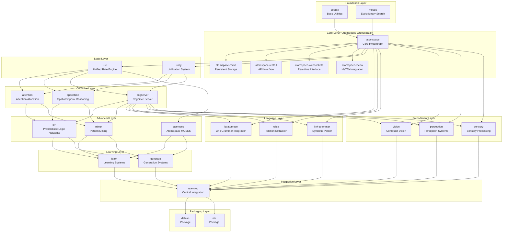
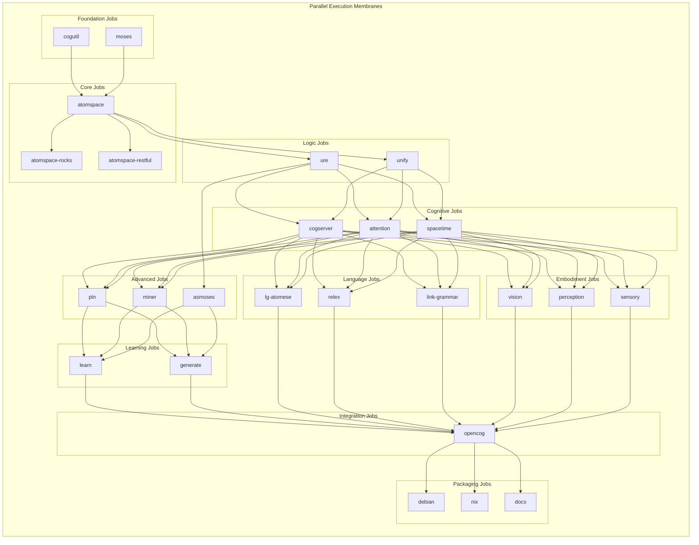

# OpenCog Central GitHub Actions Build Architecture

This document describes the cognitive orchestration build system implemented in GitHub Actions, mapping the original CircleCI configuration to the actual repository structure.

## Cognitive Hypergraph Architecture



## GitHub Actions Workflow Architecture



## Repository Structure Mapping

The GitHub Actions workflow adapts to the actual repository structure:

```
cogml/
├── orc-dv/          # Development orchestration
│   └── cogutil/     # Foundation utilities
├── orc-as/          # AtomSpace orchestration  
│   ├── atomspace/
│   ├── atomspace-rocks/
│   └── atomspace-restful/
├── orc-ai/          # AI orchestration
│   ├── moses/
│   ├── miner/
│   ├── pln/
│   ├── ure/
│   ├── asmoses/
│   └── learn/
└── orc-*/           # Other orchestral components
```

## Implementation Details

### Cognitive Tensor Shape Design

Each layer represents a different cognitive tensor dimension:

1. **Foundation (DOF=1)**: Pure utilities and basic functions
2. **Core (DOF=2)**: Hypergraph representation and storage
3. **Logic (DOF=3)**: Reasoning and unification
4. **Cognitive (DOF=4)**: Attention, space, time, emergence
5. **Advanced (DOF=5)**: Pattern recognition, probabilistic logic, learning
6. **Learning (DOF=6)**: Multi-modal learning systems
7. **Language (DOF=7)**: Natural language processing
8. **Embodiment (DOF=8)**: Sensory and motor integration
9. **Integration (DOF=9)**: Complete cognitive system

### Parallelism and Dependencies

- **Parallel Execution**: Jobs within the same membrane (layer) without mutual dependencies run in parallel
- **Dependency Encoding**: The `needs` directive encodes hypergraph links between cognitive components
- **Attention Allocation**: Resource allocation optimized for parallel builds with proper dependency ordering

### Extension Points

Each job can be extended with:
- Matrix parallelism for multiple platforms/architectures
- Resource scaling based on component complexity
- Adaptive attention mechanisms for build optimization
- Caching strategies for dependency management

## GGML Customization Notes

The workflow is designed to support GGML integration:

1. **Hardware Detection**: Automatic detection of AVX2/AVX512 capabilities
2. **Tensor Optimization**: Component-specific optimization flags
3. **Memory Management**: Efficient caching and resource allocation
4. **Parallel Processing**: Optimized job distribution for cognitive workloads

## Usage

To trigger the workflow:
```bash
git push origin main
```

Or create a pull request targeting the main branch.

The workflow will automatically build all components in the correct dependency order, leveraging GitHub Actions' parallel execution capabilities while respecting the cognitive architecture constraints.