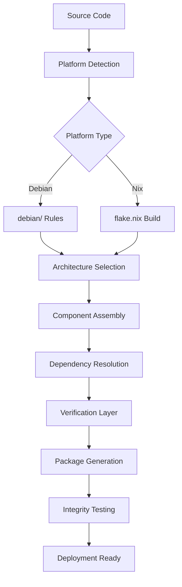

# CogML Packaging Tensor Shape Documentation

## Overview

The CogML packaging system implements a multidimensional "tensor shape" deployment architecture that provides comprehensive packaging coverage across different platforms, architectures, and use cases. This tensor encapsulates the cognitive artifacts for distribution through multiple deployment vectors.

## Tensor Dimensions

### 1. Platform Dimension (P)
The primary packaging format dimension:

- **Debian (`deb`)**: Native Debian/Ubuntu package format
  - Target: Debian-based distributions
  - Manager: `apt`, `dpkg`
  - Structure: debian/ directory with control files
  
- **Nix (`nix`)**: Functional package management
  - Target: NixOS and Nix-enabled systems
  - Manager: `nix`
  - Structure: flake.nix with reproducible builds

### 2. Architecture Dimension (A)
Supported CPU architectures:

- **amd64**: x86_64 architecture (primary)
- **arm64**: ARM 64-bit architecture
- **i386**: x86 32-bit architecture (legacy)

### 3. Component Dimension (C)
Package component hierarchy:

- **cogml**: Core runtime package
  - Contains: binaries, libraries, runtime dependencies
  - Size: ~100-500MB
  - Dependencies: Python3, essential libraries
  
- **cogml-dev**: Development package
  - Contains: headers, development libraries, build tools
  - Size: ~50-200MB
  - Dependencies: cogml, build-essential, cmake

### 4. Dependency Dimension (D)
Hierarchical dependency management:

```
Level 0 (System): cmake, python3, cargo, nodejs
Level 1 (Core): boost, numpy, pandas
Level 2 (ML): scikit-learn, matplotlib
Level 3 (Cognitive): opencog-specific libraries
```

### 5. Verification Dimension (V)
Package integrity and testing layers:

- **Structural**: File structure, permissions, dependencies
- **Functional**: Basic functionality tests
- **Integration**: Cross-component compatibility
- **Performance**: Load and execution tests

## Tensor Shape Matrix

The complete packaging tensor shape can be represented as:

```
T[P, A, C, D, V] = {
  Debian: {
    amd64: {
      cogml: [Level0, Level1, Level2, Level3] × [Structural, Functional, Integration, Performance],
      cogml-dev: [Level0, Level1, Level2, Level3] × [Structural, Functional, Integration, Performance]
    },
    arm64: { ... },
    i386: { ... }
  },
  Nix: {
    amd64: { ... },
    arm64: { ... },
    i386: { ... }
  }
}
```

## Deployment Membrane Structure

### Package Encapsulation
Each package acts as a "membrane" that encapsulates:

1. **Core Cognitive Components**
   - AtomSpace hypergraph engine
   - PLN reasoning system
   - Learning modules
   - Agent frameworks

2. **Integration Interfaces**
   - Python bindings
   - C++ libraries
   - REST APIs
   - Command-line tools

3. **Configuration Management**
   - Default configurations
   - Environment setup
   - Service definitions

### Build Process Tensor Flow



## File Structure

### Debian Package Structure
```
debian/
├── control          # Package metadata and dependencies
├── changelog        # Version history
├── rules           # Build instructions
├── compat          # Debhelper compatibility level
├── copyright       # License information
└── cogml.install   # File installation mappings
```

### Nix Package Structure
```
flake.nix           # Nix flake configuration
├── inputs          # External dependencies
├── outputs         # Build outputs and dev shells
├── packages        # Package definitions
└── checks          # Verification tests
```

## Usage Examples

### Building Debian Package
```bash
# Build package
scripts/build-packages.sh

# Install package
sudo dpkg -i build-package/output/cogml_0.1.0-1_amd64.deb
sudo apt-get install -f  # Fix dependencies

# Verify installation
cogml --version
```

### Building Nix Package
```bash
# Build with Nix
nix build .

# Install in profile
nix profile install .

# Enter development shell
nix develop
```

### Package Verification
```bash
# Verify package integrity
scripts/verify-package-integrity.sh

# Generate verification report
cat package-verification-report.txt
```

## Tensor Operations

### Package Transformation
The packaging system supports several tensor operations:

1. **Dimension Reduction**: Creating minimal packages by removing components
2. **Tensor Product**: Combining multiple components into meta-packages
3. **Slice Selection**: Extracting specific platform/architecture combinations
4. **Verification Projection**: Testing specific verification dimensions

### Example Transformations

```bash
# Reduce to core components only
export COGML_MINIMAL=true
scripts/build-packages.sh

# Cross-compile for ARM architecture
export DEB_HOST_ARCH=arm64
dpkg-buildpackage -a arm64

# Enable full verification matrix
export VERIFY_ALL_DIMENSIONS=true
scripts/verify-package-integrity.sh
```

## Integration with CI/CD

### GitHub Actions Integration
```yaml
name: Package Build Matrix
on: [push, pull_request]
jobs:
  build-matrix:
    strategy:
      matrix:
        platform: [debian, nix]
        arch: [amd64, arm64]
        component: [core, dev]
    runs-on: ubuntu-latest
    steps:
      - uses: actions/checkout@v4
      - name: Build Package
        run: scripts/build-packages.sh
      - name: Verify Package
        run: scripts/verify-package-integrity.sh
```

## Maintenance and Updates

### Version Management
- Semantic versioning: MAJOR.MINOR.PATCH
- Dependency version pinning in Nix
- Debian epoch handling for major updates

### Security Updates
- Automated dependency scanning
- CVE monitoring for packaged libraries
- Security patch integration workflow

### Performance Monitoring
- Package size tracking
- Installation time metrics
- Runtime performance regression testing

## Troubleshooting

### Common Issues
1. **Missing Dependencies**: Run dependency verification
2. **Build Failures**: Check platform-specific requirements
3. **Installation Conflicts**: Use virtual environments
4. **Permission Issues**: Verify file permissions in packages

### Debug Commands
```bash
# Debug Debian build
dpkg-buildpackage -us -uc -b --no-sign -v

# Debug Nix build
nix build . --show-trace --verbose

# Debug package installation
dpkg -i --debug package.deb
```

This tensor shape documentation provides the foundation for understanding and working with the CogML packaging deployment architecture, ensuring consistent and reliable distribution across multiple platforms and environments.