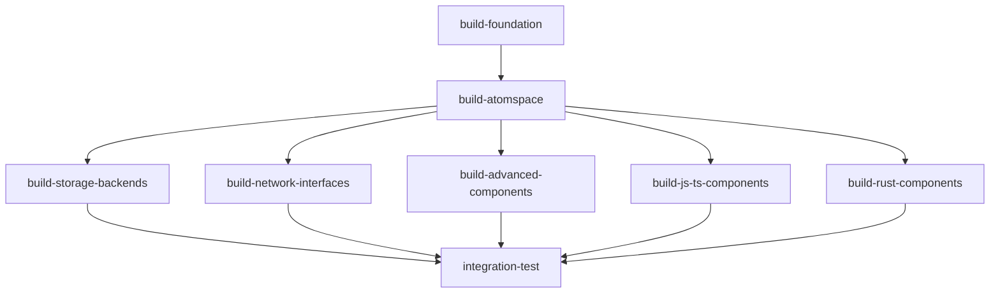

# ORC-AS Build & Install Workflow

🔧 **Comprehensive GitHub Actions workflow for building and installing all AtomSpace components**

## Quick Start

The workflow automatically triggers on:
- Changes to any component in `orc-as/`
- Changes to the foundation dependency `orc-dv/cogutil/`
- Changes to the workflow file itself

## What It Builds

### All 14 AtomSpace Components:
- **Core**: atomspace
- **Storage**: atomspace-rocks, atomspace-bridge  
- **Network**: atomspace-cog, atomspace-restful, atomspace-rpc, atomspace-websockets
- **Advanced**: atomspace-agents, atomspace-dht, atomspace-ipfs, atomspace-metta
- **Language**: atomspace-js (Rust), atomspace-typescript (Node.js)
- **Tools**: atomspace-explorer (Angular)

## Key Features

✅ **Proper dependency ordering** - cogutil → atomspace → other components  
✅ **Multi-technology support** - CMake, Node.js, Rust  
✅ **Build caching** - Optimized CI performance  
✅ **Matrix builds** - Parallel component building  
✅ **Comprehensive testing** - Unit tests + integration validation  
✅ **Error resilience** - Graceful handling of missing features  

## Architecture

## Documentation

📖 See [docs/orc-as-build-workflow.md](docs/orc-as-build-workflow.md) for detailed documentation.

---
*Created for issue #98 - Complete AtomSpace ecosystem build & test automation*