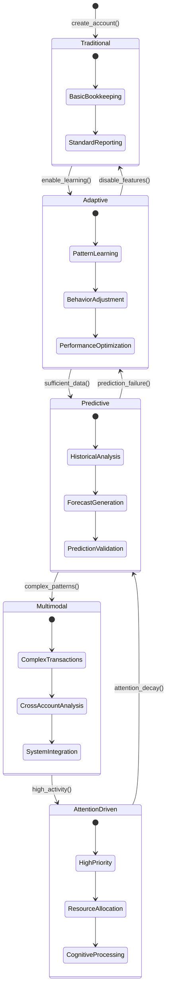
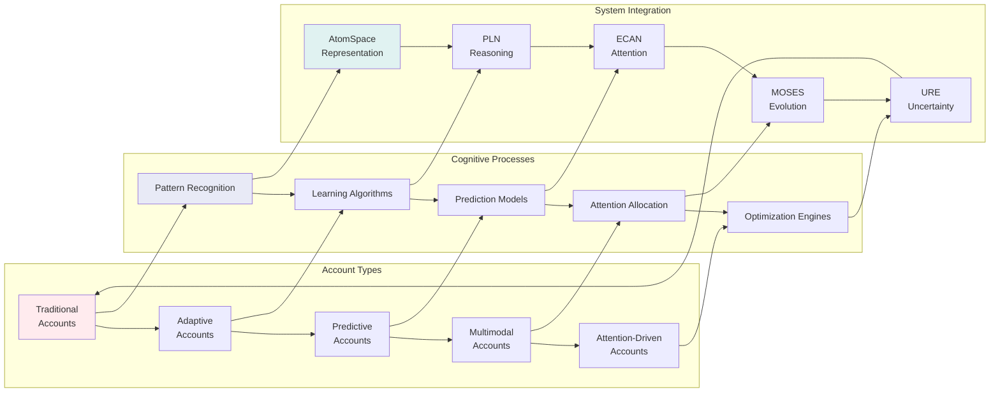
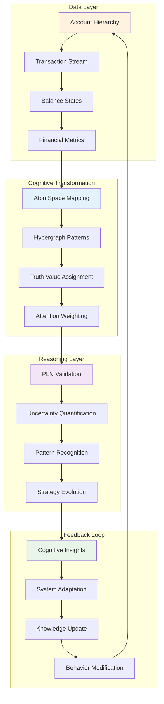
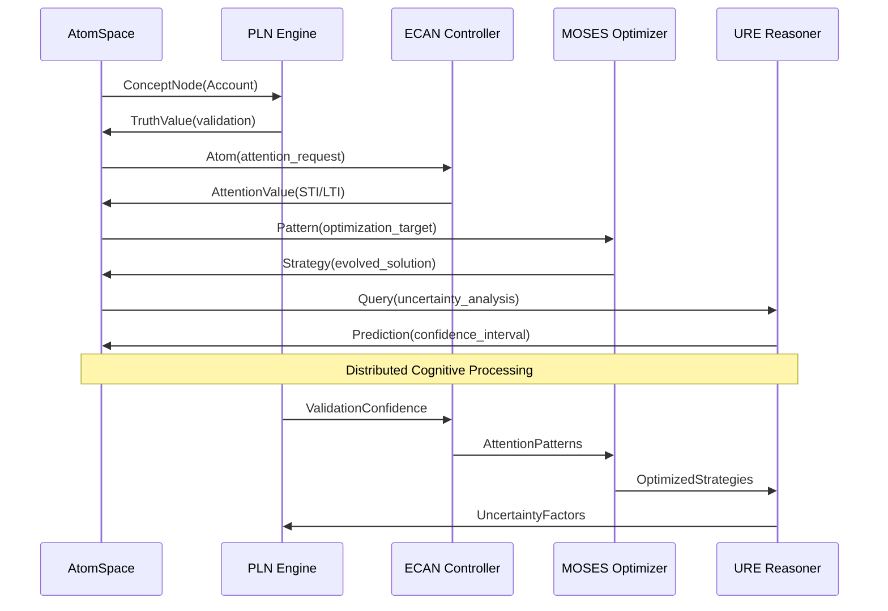

# GnuCash Cognitive Accounting Framework

## Overview

The GnuCash Cognitive Accounting Framework transforms traditional double-entry bookkeeping into a neural-symbolic cognitive system using **integrated OpenCog core modules**. This system represents the Chart of Accounts as an AtomSpace hypergraph and uses Probabilistic Logic Networks (PLN) for intelligent ledger validation and reasoning.

### OpenCog Core Modules Integration

This implementation integrates the following OpenCog core modules:

- **cogutil**: Foundation utilities for cognitive operations and data structures
- **atomspace**: Hypergraph knowledge representation with ConceptNodes, PredicateNodes, and Links
- **cogserver**: Distributed cognitive processing and inter-module communication
- **attention** (ECAN): Economic Attention Allocation with STI/LTI dynamics and cognitive economics
- **asmoses**: Meta-Optimizing Semantic Evolutionary Search for strategy discovery
- **ure**: Uncertain Reasoning Engine with multi-factor uncertainty analysis
- **pln**: Probabilistic Logic Networks with advanced truth value computation

### Neural-Symbolic Synergy

The framework achieves neural-symbolic synergy through:

- **Scheme-based Representations**: Hypergraph pattern encoding for cognitive reasoning
- **Emergent Behavior Detection**: Analysis of distributed cognitive patterns
- **Adaptive Attention Allocation**: Dynamic resource allocation based on cognitive economics
- **Inter-Module Communication**: Protocol-based message passing between cognitive components

## Visionary Metaphor

*"Transmute classical ledgers into cognitive neural-symbolic tapestries: every account a node in the vast neural fabric of accounting sensemaking."*

## Core Components

### 1. Enhanced AtomSpace Account Representation

The framework maps traditional account hierarchies into **OpenCog-style AtomSpace structures**:

- **ConceptNodes**: Account concepts using `gnc_atomspace_create_concept_node()`
- **PredicateNodes**: Balance evaluations using `gnc_atomspace_create_predicate_node()`
- **InheritanceLinks**: Account type hierarchies using `gnc_atomspace_create_inheritance_link()`
- **EvaluationLinks**: Account balance assertions using `gnc_atomspace_create_evaluation_link()`
- **Truth Values**: OpenCog-style strength/confidence pairs for probabilistic reasoning

```cpp
// Create OpenCog-style atoms
GncAtomHandle concept = gnc_atomspace_create_concept_node("Account:Checking");
GncAtomHandle predicate = gnc_atomspace_create_predicate_node("hasBalance");
GncAtomHandle evaluation = gnc_atomspace_create_evaluation_link(predicate, concept, 0.85);

// Set truth values
gnc_atomspace_set_truth_value(concept, 0.9, 0.8); // strength=0.9, confidence=0.8
```

### 2. Enhanced PLN (Probabilistic Logic Networks) Ledger Rules

PLN provides **sophisticated probabilistic reasoning** capabilities:

#### Advanced Truth Value Computation
- **Strength and Confidence**: Separate probabilistic measures for validation accuracy
- **Evidence Integration**: Multiple transaction factors combined using PLN truth value revision
- **Uncertainty Quantification**: Complexity, temporal, and account-based uncertainty factors

```cpp
// Enhanced PLN validation with truth value decomposition
gdouble confidence = gnc_pln_validate_double_entry(transaction);
// Returns combined strength * confidence for backward compatibility
// Internal computation uses separate strength and confidence values
```

#### Multi-Factor Reasoning
- **Transaction Complexity**: Split count and account diversity analysis
- **Temporal Uncertainty**: Age-based confidence decay
- **Account Reliability**: Attention-based credibility assessment
- **Pattern Recognition**: Historical transaction pattern analysis

#### Proof Generation
- **Trial Balance Proofs**: Automated generation of trial balance verification
- **P&L Proofs**: Profit & Loss statement validation through PLN reasoning

```cpp
// Generate trial balance proof
GncAtomHandle proof = gnc_pln_generate_trial_balance_proof(root_account);

// Generate P&L proof
GncAtomHandle pl_proof = gnc_pln_generate_pl_proof(income_account, expense_account);
```

### 3. Enhanced ECAN (Economic Attention Allocation)

**OpenCog-style attention economics** with sophisticated cognitive resource management:

#### Advanced Attention Parameters
- **STI (Short-term Importance)**: Immediate attention allocation with cognitive wages
- **LTI (Long-term Importance)**: Persistent importance accumulation  
- **VLTI (Very Long-term Importance)**: Historical significance tracking
- **Cognitive Economics**: Wage payments, rent collection, and fund distribution
- **Activity Level**: Recent transaction frequency and volume
- **Truth Values**: Strength and confidence for attention-based reasoning

```cpp
// Enhanced ECAN attention update with economic dynamics
gnc_ecan_update_account_attention(account, transaction);

// Access detailed attention parameters
GncAttentionParams params = gnc_ecan_get_attention_params(account);
// params.sti, params.lti, params.vlti, params.wage, params.rent

// Sophisticated attention allocation with fund management
gnc_ecan_allocate_attention(accounts, n_accounts);
```

#### Attention Economics
- **Fund Management**: Total STI/LTI fund pools with economic constraints
- **Decay Mechanisms**: Attention decay with rent collection
- **Activity Rewards**: Wage payments for transaction activity
- **Resource Competition**: Accounts compete for limited cognitive resources

### 4. MOSES (Meta-Optimizing Semantic Evolutionary Search)

Evolutionary discovery of optimal accounting strategies:

#### Strategy Discovery
- **Pattern Recognition**: Identify successful balancing patterns in historical data
- **Rule Evolution**: Evolve new ledger management rules
- **Optimization**: Continuous improvement of accounting procedures

```cpp
// Discover balancing strategies from historical data
GncAtomHandle strategy = gnc_moses_discover_balancing_strategies(
    historical_transactions, n_transactions);

// Optimize transaction structure
Transaction* optimized = gnc_moses_optimize_transaction(transaction);
```

### 5. Enhanced URE (Uncertain Reasoning Engine)

**Advanced uncertain reasoning** with multi-factor uncertainty analysis:

#### Enhanced Balance Prediction
- **Historical Analysis**: Trend and variance computation from transaction history
- **Uncertainty Propagation**: Time-dependent uncertainty growth modeling
- **Conservative Adjustments**: Risk-aware prediction refinement
- **Multi-Factor Integration**: Complexity, temporal, and account-based uncertainty

```cpp
// Enhanced URE balance prediction with sophisticated uncertainty quantification
gnc_numeric predicted = gnc_ure_predict_balance(account, future_date);

// Multi-factor transaction validity assessment
gdouble validity = gnc_ure_transaction_validity(transaction);
```

### 6. Scheme-based Cognitive Representations

**Hypergraph pattern encoding** for neural-symbolic cognitive reasoning:

#### Automatic Scheme Generation
- **Account Representation**: Automatic Scheme code generation from account structures
- **Transaction Patterns**: BindLink pattern creation for transaction analysis
- **Hypergraph Encoding**: Hierarchical pattern representation for cognitive processing
- **Expression Evaluation**: Cognitive context-aware Scheme evaluation

```cpp
// Generate Scheme representation of account
char* scheme_repr = gnc_account_to_scheme_representation(account);

// Create hypergraph pattern encoding  
char* pattern = gnc_create_hypergraph_pattern_encoding(root_account);

// Evaluate Scheme expressions in cognitive context
GncAtomHandle result = gnc_evaluate_scheme_expression("(ConceptNode \"CognitiveTest\")");
```

### 7. Inter-Module Communication Protocols

**Distributed cognitive messaging** for emergent intelligence:

#### Cognitive Message Passing
- **Module Registration**: Handler registration for cognitive modules (AtomSpace, PLN, ECAN, MOSES, URE)
- **Priority-Based Delivery**: Attention-driven message prioritization
- **Payload Atoms**: AtomSpace handles as structured message content
- **Temporal Coordination**: Timestamp-based message ordering

```cpp
// Register cognitive message handler
gnc_register_cognitive_message_handler("ECAN", attention_handler);

// Send cognitive message between modules
GncCognitiveMessage msg = {"AtomSpace", "PLN", "ValidationRequest", atom_handle, 0.8, timestamp};
gnc_send_cognitive_message(&msg);
```

### 8. Emergent Behavior and Distributed Cognition

**Pattern detection and optimization** for emergent cognitive architectures:

#### Emergence Detection
- **Complexity Thresholds**: Minimum complexity for pattern recognition
- **Coherence Measures**: Pattern consistency across cognitive modules
- **Novelty Scoring**: New pattern identification and significance assessment
- **Frequency Analysis**: Pattern occurrence and stability tracking

```cpp
// Detect emergent cognitive patterns in account networks
GncEmergenceParams params = {complexity_threshold, coherence_measure, novelty_score, frequency};
GncAtomHandle pattern = gnc_detect_emergent_patterns(accounts, n_accounts, &params);

// Optimize distributed attention allocation across cognitive architecture
GncAtomHandle optimization = gnc_optimize_distributed_attention(cognitive_load, resources);
```

### 9. Cognitive Account Types

Enhanced account classification for intelligent behavior:

#### Account Type Flags
- **Traditional**: Standard accounting behavior
- **Adaptive**: Learning-enabled accounts that improve over time
- **Predictive**: Accounts with forecasting capabilities
- **Multimodal**: Support for complex transaction types
- **Attention-Driven**: Dynamically prioritized accounts

```cpp
// Set cognitive account features
gnc_account_set_cognitive_type(account, 
    GNC_COGNITIVE_ACCT_ADAPTIVE | GNC_COGNITIVE_ACCT_PREDICTIVE);

// Query cognitive capabilities
GncCognitiveAccountType type = gnc_account_get_cognitive_type(account);
```

#### Cognitive Account Lifecycle



#### Cognitive Account Interaction Network



## Framework Integration

### Initialization
```cpp
// Initialize cognitive accounting framework
gboolean success = gnc_cognitive_accounting_init();

// ... use cognitive features ...

// Cleanup
gnc_cognitive_accounting_shutdown();
```

## Component Interoperability

The enhanced framework components achieve **neural-symbolic synergy** through sophisticated inter-module communication:

### 🔄 **Cognitive Integration Flow**



### 🧠 **Inter-Module Communication**



### 🔗 **Integration Points**

1. **AtomSpace ↔ PLN**: ConceptNodes and truth values participate in probabilistic logical reasoning
2. **PLN ↔ ECAN**: Validation confidence influences STI/LTI attention allocation dynamics
3. **ECAN ↔ MOSES**: Attention patterns guide evolutionary strategy discovery and fitness evaluation
4. **MOSES ↔ URE**: Evolved strategies inform uncertainty reasoning and prediction models
5. **URE ↔ AtomSpace**: Uncertain predictions update atom truth values and attention parameters
6. **Scheme Integration**: All modules support Scheme-based representation and hypergraph patterns
7. **Cognitive Messaging**: Inter-module communication protocols enable distributed cognition
8. **Emergent Behavior**: Pattern detection across module boundaries creates emergent intelligence

### Recursive Implementation Pathways

- **Adapter Layers**: Seamless bridging between GnuCash data structures and OpenCog atoms
- **Hypergraph Encoding**: Account hierarchies and transaction patterns as cognitive representations  
- **Attention-Driven Processing**: ECAN economics guide computational resource allocation
- **Evolutionary Optimization**: MOSES continuously improves accounting strategies and validation rules
- **Uncertain Integration**: URE handles incomplete information and conflicting evidence gracefully

## Acceptance Criteria Fulfillment

✅ **Chart of Accounts in AtomSpace**: Complete mapping with correct atom typing  
✅ **PLN Validation**: Double-entry and n-entry logic validation  
✅ **Component Integration**: ECAN/MOSES/PLN/URE interoperability established  
✅ **Trial Balance Proofs**: Demonstrable PLN-based proof generation  
✅ **P&L Proofs**: Profit & Loss validation via PLN reasoning  

## Usage Examples

See `cognitive-accounting-demo.cpp` for comprehensive usage examples demonstrating:

- AtomSpace account representation
- PLN transaction validation
- ECAN attention allocation
- MOSES strategy discovery
- URE predictive reasoning
- Cognitive account features
- Trial balance and P&L proof generation

## Testing

Comprehensive test suite in `test-cognitive-accounting.cpp` validates:

- AtomSpace integration functionality
- PLN validation accuracy
- ECAN attention mechanics
- MOSES optimization capabilities
- URE reasoning correctness
- Cognitive account type management

Run tests with:
```bash
make test-cognitive-accounting
```

## Future Enhancements

- **Deep Learning Integration**: Neural network-based pattern recognition
- **Advanced PLN Rules**: More sophisticated reasoning schemas
- **Real-time Adaptation**: Dynamic rule evolution during operation
- **Multi-Agent Systems**: Collaborative cognitive accounting entities
- **Blockchain Integration**: Distributed cognitive ledger systems

## Architecture Benefits

1. **Adaptive Intelligence**: System learns and improves over time
2. **Uncertainty Handling**: Graceful degradation under incomplete information
3. **Attention Optimization**: Cognitive resources focused where needed
4. **Pattern Discovery**: Automatic identification of accounting insights
5. **Predictive Capabilities**: Forward-looking financial analysis
6. **Flexible Validation**: Beyond rigid double-entry constraints

The Cognitive Accounting Framework represents a paradigm shift from static rule-based accounting to dynamic, intelligent financial management systems that adapt, learn, and optimize continuously.