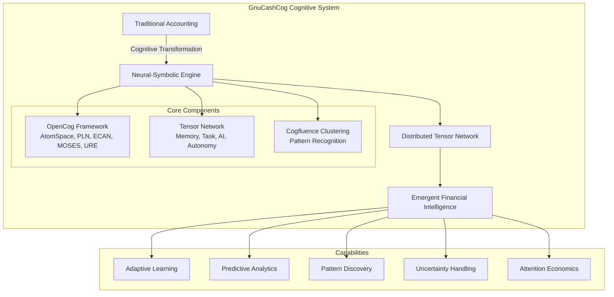

############################################################
          GnuCash Cognitive Engine README
          
Advanced Neural-Symbolic Accounting System
The current stable series is GnuCashCog 2.x.
------------------------------------------------------------

## 🧠 Cognitive Architecture Overview

GnuCashCog transforms traditional double-entry bookkeeping into a **distributed cognitive tensor network** that learns, adapts, and evolves. This implementation creates a "living grammar of cognition" where financial data flows through specialized neural-symbolic nodes.



## 🎯 Key Features

### 🔮 **Distributed Tensor Network**
- **Memory Node**: Stores transactions, clusters, and states as tensor data
- **Task Node**: Orchestrates workflow and triggers clustering operations  
- **AI Node**: Financial pattern recognition with Cogfluence clustering
- **Autonomy Node**: Self-modification and attention allocation

### 🧮 **Neural-Symbolic Integration**
- **AtomSpace**: Hypergraph knowledge representation
- **PLN**: Probabilistic Logic Networks for validation
- **ECAN**: Economic Attention Allocation
- **MOSES**: Meta-Optimizing Evolutionary Search
- **URE**: Uncertain Reasoning Engine

### 🎨 **Cogfluence Clustering**
- Advanced financial pattern recognition
- Emergent economic insight discovery
- Adaptive clustering algorithms
- Real-time pattern detection

### ⚡ **High-Performance Computing**
- **ggml Integration**: Optimized tensor operations
- **Message Passing**: Asynchronous inter-node communication
- **Attention Economics**: Dynamic resource allocation
- **Distributed Processing**: Scalable cognitive architecture

## 📚 Table of Contents

  - [🧠 Cognitive Architecture Overview](#-cognitive-architecture-overview)
  - [🎯 Key Features](#-key-features)
  - [📖 Documentation](#-documentation)
  - [🔧 Dependencies](#-dependencies)
  - [🚀 Getting Started](#-getting-started)
  - [🏗️ Building & Installing](#️-building--installing)
  - [🖥️ Supported Platforms](#️-supported-platforms)
  - [📥 Downloads](#-downloads)
  - [🔄 Getting Source with Git](#-getting-source-with-git)
  - [👨‍💻 Developing GnuCashCog](#-developing-gnucashcog)

## 📖 Documentation

### 📋 **Core Documentation**
- 🧠 **[Cognitive Accounting Framework](COGNITIVE_ACCOUNTING.md)** - Neural-symbolic accounting system
- 🕸️ **[Tensor Network Architecture](TENSOR_NETWORK_ARCHITECTURE.md)** - Distributed cognitive nodes
- 📊 **[Implementation Report](IMPLEMENTATION_REPORT.md)** - Technical implementation details

### 🔗 **External Resources**
- 🌐 **Home Page**: https://www.gnucash.org/
- 📚 **Wiki**: https://wiki.gnucash.org/wiki/GnuCash
- 💾 **Downloads**: https://www.gnucash.org/download

## 🎨 System Architecture



```mermaid
graph LR
    subgraph "Input Layer"
        A[Financial Data] --> B[Transactions]
        B --> C[Accounts]
        C --> D[Balances]
    end
    
    subgraph "Cognitive Processing"
        E[AtomSpace<br/>Hypergraph] --> F[PLN<br/>Validation]
        F --> G[ECAN<br/>Attention]
        G --> H[MOSES<br/>Evolution]
        H --> I[URE<br/>Uncertainty]
    end
    
    subgraph "Tensor Network"
        J[Memory Node] --> K[Task Node]
        K --> L[AI Node]
        L --> M[Autonomy Node]
    end
    
    subgraph "Output Layer"
        N[Insights] --> O[Predictions]
        O --> P[Adaptations]
        P --> Q[Intelligence]
    end
    
    D --> E
    I --> J
    M --> N
    Q --> A
```

## 🔧 Dependencies

### 📦 **Core Dependencies**
- **cmake**: Build system (https://cmake.org)
- **ninja**: Fast build tool (https://ninja-build.org)
- **glib**: Foundation library for cognitive operations
- **libxml2**: XML processing for financial data
- **SWIG**: 2.0.10+ for language bindings (http://www.swig.org)

### 🧠 **Cognitive Architecture Dependencies**
- **OpenCog**: Core cognitive framework components
  - `atomspace`: Hypergraph knowledge representation
  - `cogutil`: Cognitive utilities and data structures
  - `attention`: ECAN attention allocation
  - `pln`: Probabilistic Logic Networks
  - `moses`: Meta-optimizing evolutionary search
  - `ure`: Uncertain reasoning engine
- **ggml**: High-performance tensor operations (optional)
- **Cogfluence**: Enhanced clustering algorithms

### 🔍 **Optional Dependencies**
- **Perl**: For online stock/currency price retrieval
- **Google Test**: For comprehensive testing framework
- **Valgrind**: Memory debugging and profiling

**Installation Notes:**
- Run `gnc-fq-update` as root for latest financial quote modules
- Windows: Use "Install Online Quotes" from Start menu
- macOS: Use "Update Finance Quote" from distribution disk image

Please see `README.dependencies` for detailed build dependency information.

## 🚀 Getting Started

### 🎮 **Basic Usage**
```bash
# Launch GnuCashCog
gnucash [filename]

# With cognitive features enabled
gnucash --enable-cognitive-accounting [filename]

# Run tensor network demo
./tensor-network-demo

# Test cognitive accounting
./test-cognitive-accounting.sh
```

### 🔧 **Environment Variables**
- `GNC_BOOTSTRAP_SCM`: Location of initial bootstrapping scheme code
- `GUILE_LOAD_PATH`: Override for GnuCash scheme file loading path
- `GNC_MODULE_PATH`: Override for GnuCash module loading path  
- `GNC_DEBUG`: Enable debugging output for early startup
- `GNC_COGNITIVE_DEBUG`: Enable cognitive architecture debugging

### 📁 **Sample Files**
- `*.gnucash`: GnuCash account files (Open File menu)
- `*.qif`: Quicken Import Format files (Import QIF menu)
- `doc/examples/`: Sample accounts and transactions
- `cognitive-accounting-demo.cpp`: Cognitive features demonstration

## 🌍 Internationalization

GnuCashCog supports multiple languages through message catalogs. The system automatically uses your desktop environment's locale, but this can be overridden.

**Override Locale Settings:**
- Visit: https://wiki.gnucash.org/wiki/Locale_Settings
- Configure regional financial formatting
- Set cognitive reasoning language preferences

## 🏗️ Building & Installing

### 🚀 **Quick Start**
```bash
# Configure with cognitive features
cmake -B build -S . -DCMAKE_BUILD_TYPE=Release \
    -DHAVE_COGNITIVE_ACCOUNTING=ON \
    -DHAVE_GGML=ON \
    -DHAVE_COGFLUENCE_CLUSTERING=ON

# Build with ninja (faster)
cmake --build build --parallel

# Install
cmake --install build
```

### 🔧 **Build Options**
- `CMAKE_INSTALL_PREFIX`: Runtime installation directory
- `CMAKE_BUILD_TYPE`: Debug, Release, RelWithDebInfo
- `HAVE_COGNITIVE_ACCOUNTING`: Enable cognitive features
- `HAVE_GGML`: Enable tensor operations
- `HAVE_COGFLUENCE_CLUSTERING`: Enable advanced clustering

### 📦 **Dependencies Installation**
```bash
# Ubuntu/Debian
sudo apt-get install cmake ninja-build libglib2.0-dev libxml2-dev

# macOS
brew install cmake ninja glib libxml2

# Build OpenCog dependencies
git clone https://github.com/opencog/opencog
cd opencog && mkdir build && cd build
cmake .. && make -j4 && sudo make install
```

### 🏭 **Advanced Build Configuration**
```cmake
# Enable full cognitive stack
set(HAVE_COGNITIVE_ACCOUNTING ON)
set(HAVE_GGML ON)
set(HAVE_COGFLUENCE_CLUSTERING ON)
set(HAVE_OPENCOG_ATOMSPACE ON)
set(HAVE_OPENCOG_PLN ON)
set(HAVE_OPENCOG_ECAN ON)
set(HAVE_OPENCOG_MOSES ON)
set(HAVE_OPENCOG_URE ON)
```

### 🚢 **DESTDIR Installation**
```bash
# Stage installation for packaging
make DESTDIR=/tmp/staging install

# Creates staged directory structure under /tmp/staging
# Useful for creating distribution packages
```

**Note:** GNOME libraries are required but a GNOME desktop is not necessary.

**Platform-Specific Instructions:**
- **GNU/Linux**: https://wiki.gnucash.org/wiki/Building
- **macOS**: Set `GNOME_PATH` and `GNOME_LIBCONFIG_PATH` if needed
- **Windows**: Use MSYS2 or WSL for cognitive features


## 🖥️ Supported Platforms

### ✅ **Fully Supported**
- **GNU/Linux**: x86_64, ARM64, with full cognitive features
- **macOS**: Intel/Apple Silicon, versions 10.15+
- **FreeBSD**: x86_64, with OpenCog support
- **OpenBSD**: x86_64, basic cognitive features

### 🔧 **Cognitive Architecture Support**
- **OpenCog Integration**: Linux, macOS, FreeBSD
- **Tensor Operations**: Platforms with ggml support
- **Distributed Processing**: All POSIX-compliant systems
- **GPU Acceleration**: CUDA/OpenCL capable systems (future)

### 🎯 **Performance Tiers**
- **Tier 1**: Full cognitive features + GPU acceleration
- **Tier 2**: Complete OpenCog integration + tensor operations  
- **Tier 3**: Basic cognitive features + attention allocation
- **Tier 4**: Traditional accounting with minimal cognitive support

GnuCashCog can be ported to any platform supporting GTK+ and C++17 with sufficient expertise and effort. For platform-specific issues, join our development mailing list at `gnucash-devel@gnucash.org`.

## 📥 Downloads

### 🔗 **Official Sources**
- **Source Code**: https://github.com/OzCog/gnucashcog-v2
- **Releases**: https://github.com/OzCog/gnucashcog-v2/releases
- **Original GnuCash**: https://www.gnucash.org/download

### 🐧 **Distribution Packages**
- **Ubuntu/Debian**: `apt-get install gnucash-cognitive`
- **Fedora/RHEL**: `dnf install gnucash-cognitive`
- **Arch Linux**: `pacman -S gnucash-cognitive`
- **macOS**: `brew install gnucash-cognitive`

### 🏗️ **Build from Source**
For the latest cognitive features, build from source using the instructions above. Distribution packages may lag behind the latest neural-symbolic innovations.

## 🔄 Getting Source with Git

### 🚀 **Quick Clone**
```bash
# Clone the cognitive engine repository
git clone https://github.com/OzCog/gnucashcog-v2.git
cd gnucashcog-v2

# Initialize submodules for cognitive dependencies
git submodule update --init --recursive
```

### 🌟 **Development Workflow**
```bash
# Fork on GitHub first, then clone your fork
git clone https://github.com/YOUR_USERNAME/gnucashcog-v2.git
cd gnucashcog-v2

# Add upstream remote
git remote add upstream https://github.com/OzCog/gnucashcog-v2.git

# Create feature branch
git checkout -b feature/cognitive-enhancement

# Make changes, test, commit
git add .
git commit -m "Add: Neural-symbolic feature enhancement"

# Push and create pull request
git push origin feature/cognitive-enhancement
```

### 📚 **Repository Structure**
```
gnucashcog-v2/
├── libgnucash/engine/          # Core cognitive engine
├── gnucash/                    # UI and reporting
├── doc/                        # Documentation
├── COGNITIVE_ACCOUNTING.md     # Neural-symbolic framework
├── TENSOR_NETWORK_ARCHITECTURE.md  # Distributed processing
├── tensor-network-demo.cpp     # Cognitive demonstrations
└── test-cognitive-accounting.sh # Integration tests
```

## 👨‍💻 Developing GnuCashCog

### 🚀 **Getting Started**
Before contributing to the cognitive engine, complete these steps:

1. **📚 Read the Development Guide**
   - https://wiki.gnucash.org/wiki/Development
   - [Cognitive Architecture Framework](COGNITIVE_ACCOUNTING.md)
   - [Tensor Network Documentation](TENSOR_NETWORK_ARCHITECTURE.md)

2. **🔍 Review Documentation**
   - Doxygen: https://code.gnucash.org/docs/MASTER/
   - Cognitive API: Browse `libgnucash/engine/gnc-cognitive-accounting.h`
   - Tensor Network API: Browse `libgnucash/engine/gnc-tensor-network.h`

3. **💬 Join the Community**
   - Development mailing list: `gnucash-devel@gnucash.org`
   - Cognitive architecture discussions: GitHub Issues
   - OpenCog integration: `opencog-dev@googlegroups.com`

4. **🔨 Build and Test**
   ```bash
   # Build cognitive features
   cmake -B build -DHAVE_COGNITIVE_ACCOUNTING=ON
   cmake --build build
   
   # Run comprehensive tests
   make test-cognitive-accounting
   make test-tensor-network
   
   # Run demos
   ./tensor-network-demo
   ./cognitive-accounting-demo
   ```

### 🧠 **Cognitive Architecture Development**

#### 🔧 **Core Components**
- **AtomSpace Integration**: Hypergraph knowledge representation
- **PLN Reasoning**: Probabilistic logic for validation
- **ECAN Attention**: Economic attention allocation
- **Tensor Networks**: Distributed cognitive processing
- **Cogfluence Clustering**: Advanced pattern recognition

#### 📝 **Code Style**
- Follow existing OpenCog conventions
- Use meaningful variable names reflecting cognitive concepts
- Document complex neural-symbolic algorithms
- Include comprehensive unit tests

#### 🧪 **Testing Requirements**
- **Unit Tests**: Test individual cognitive components
- **Integration Tests**: Test OpenCog module interactions
- **Performance Tests**: Validate tensor operation efficiency
- **Regression Tests**: Ensure cognitive features don't break existing functionality

### 🔄 **Contribution Workflow**

#### 📋 **Submitting Patches**
1. **📖 Read**: https://wiki.gnucash.org/wiki/Development#Submitting_Patches
2. **🍴 Fork**: Create a GitHub fork
3. **🌿 Branch**: Create feature branch from `stable`
4. **🔨 Develop**: Implement cognitive enhancements
5. **✅ Test**: Ensure all tests pass
6. **📝 Document**: Update relevant documentation
7. **🚀 Submit**: Create pull request with detailed description

#### 🎯 **Focus Areas**
- **Neural-Symbolic Integration**: Bridging symbolic and neural approaches
- **Cognitive Economics**: Attention allocation and resource management
- **Pattern Recognition**: Financial insight discovery
- **Distributed Processing**: Scalable cognitive architectures
- **Uncertainty Reasoning**: Handling incomplete financial information

### 🏆 **Advanced Topics**

#### 🔬 **Research Areas**
- **Emergent Behavior**: Complex system properties arising from simple rules
- **Cognitive Architectures**: Multi-agent financial reasoning systems
- **Hypergraph Patterns**: Advanced knowledge representation
- **Evolutionary Algorithms**: Self-improving financial strategies

#### 🤝 **Collaboration**
- **OpenCog Community**: Core cognitive architecture development
- **GnuCash Community**: Traditional accounting integration
- **Academic Partnerships**: Research collaboration opportunities
- **Industry Integration**: Real-world cognitive accounting applications

### 📊 **Performance Considerations**
- **Memory Management**: Efficient tensor allocation
- **Attention Economics**: Dynamic resource allocation
- **Message Passing**: Optimized inter-node communication
- **Parallel Processing**: Multi-core cognitive operations

### 🔮 **Future Directions**
- **GPU Acceleration**: CUDA/OpenCL tensor operations
- **Distributed Computing**: Multi-node cognitive networks
- **Real-time Processing**: Streaming financial analysis
- **Deep Learning**: Neural network integration
- **Quantum Computing**: Quantum-enhanced reasoning (experimental)

Thank you for contributing to the evolution of cognitive accounting! 🧠✨

---

*"Every contribution helps transmute classical ledgers into cognitive neural-symbolic tapestries, where financial meaning emerges from the recursive interplay of distributed intelligence."*
