# Distributed Tensor Network Architecture Documentation

## Overview

This document describes the distributed ggml tensor network architecture that transforms GnuCashCog into an agentic cognitive system. The architecture implements a living grammar of cognition where each component serves as a node in the tensor network.

### Complete System Integration

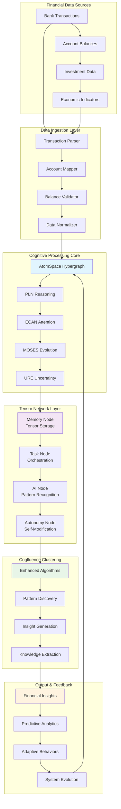

### Cognitive Architecture Flow

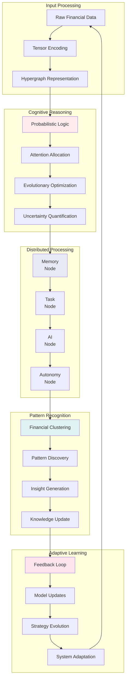

## System Architecture

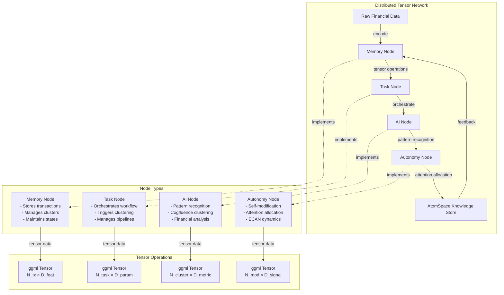

## Message Passing Architecture

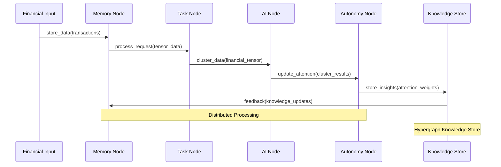

## Tensor Data Flow

```mermaid
flowchart LR
    subgraph "Input Layer"
        A[Transactions] --> B[Account Data]
        B --> C[Financial Metrics]
    end
    
    subgraph "Tensor Encoding"
        D[Transaction Tensor<br/>shape: [N_tx, D_feat]]
        E[Account Tensor<br/>shape: [N_acc, D_acc]]
        F[Metric Tensor<br/>shape: [N_metric, D_val]]
    end
    
    subgraph "Processing Nodes"
        G[Memory Node Processing]
        H[Task Node Processing]
        I[AI Node Processing]
        J[Autonomy Node Processing]
    end
    
    subgraph "Output Layer"
        K[Clustered Data]
        L[Attention Weights]
        M[Insights]
    end
    
    A --> D
    B --> E
    C --> F
    
    D --> G
    E --> H
    F --> I
    
    G --> J
    H --> J
    I --> J
    
    J --> K
    J --> L
    J --> M
```

## Cogfluence Clustering Integration

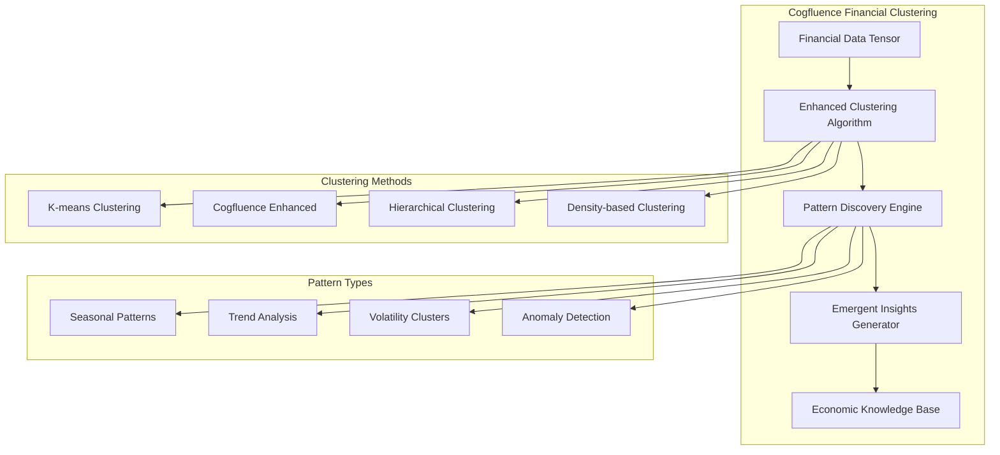

## ECAN Attention Allocation

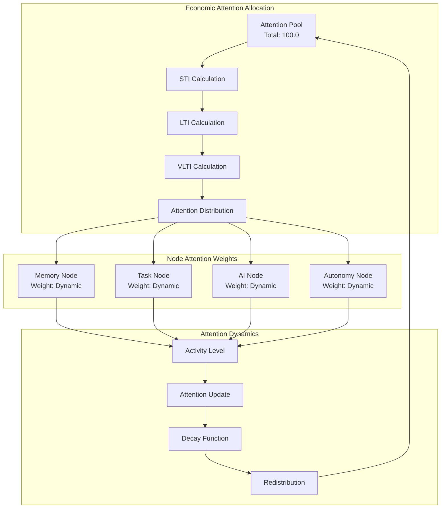

## Network Synchronization

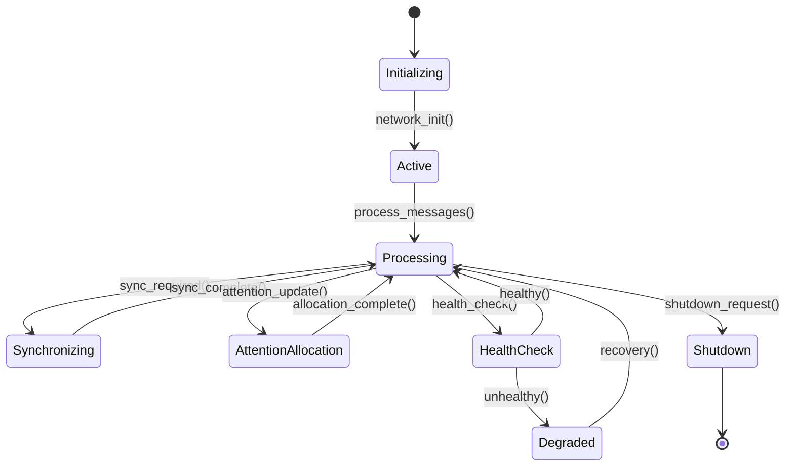

## Component Integration

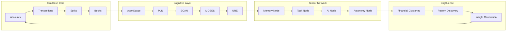

## API Architecture

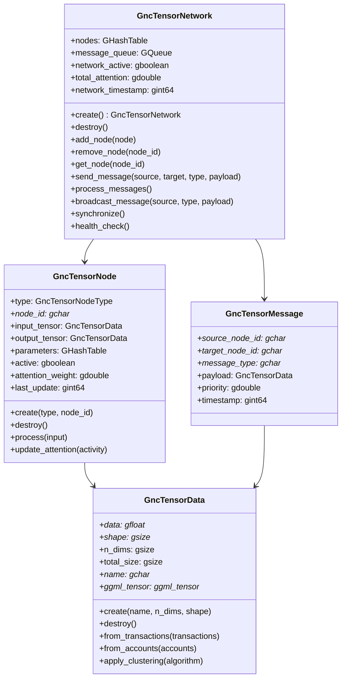

## Installation and Dependencies

### Required Dependencies

- **ggml**: Tensor operations library
- **OpenCog**: Cognitive architecture framework
- **glib**: Foundation library
- **cmake**: Build system

### Optional Dependencies

- **OpenCog modules**: atomspace, pln, ecan, moses, ure
- **Google Test**: For testing

### Build Configuration

```cmake
# Enable tensor network support
set(HAVE_GGML 1)
set(HAVE_COGFLUENCE_CLUSTERING 1)
add_definitions(-DHAVE_GGML -DHAVE_COGFLUENCE_CLUSTERING)
```

## Usage Examples

### Basic Tensor Network Initialization

```c
// Initialize tensor network
gnc_tensor_network_init();

// Create network context
GncTensorNetwork* network = gnc_tensor_network_create();

// Create nodes
GncTensorNode* memory = gnc_tensor_node_create(GNC_TENSOR_NODE_MEMORY, "memory");
GncTensorNode* ai = gnc_tensor_node_create(GNC_TENSOR_NODE_AI, "ai");

// Add nodes to network
gnc_tensor_network_add_node(network, memory);
gnc_tensor_network_add_node(network, ai);

// Send messages
gnc_tensor_network_send_message(network, "memory", "ai", "process_data", tensor_data);
gnc_tensor_network_process_messages(network);

// Cleanup
gnc_tensor_network_destroy(network);
gnc_tensor_network_shutdown();
```

### Cogfluence Clustering

```c
// Create financial data tensor
GncTensorData* financial_data = gnc_tensor_data_create("financial_data", 2, shape);
GncTensorData* cluster_output = gnc_tensor_data_create("clusters", 2, shape);

// Apply Cogfluence clustering
gnc_cogfluence_cluster_transactions(financial_data, cluster_output, "enhanced");

// Discover patterns
GncTensorData* patterns = gnc_tensor_data_create("patterns", 2, shape);
gnc_cogfluence_discover_patterns(cluster_output, patterns, 0.5);

// Generate insights
GHashTable* insights = g_hash_table_new_full(g_str_hash, g_str_equal, g_free, g_free);
gnc_cogfluence_generate_insights(cluster_output, insights);
```

## Testing

The tensor network includes comprehensive tests covering:

- Network initialization and shutdown
- Node creation and management
- Tensor data encoding and operations
- Message passing and communication
- Attention allocation and ECAN dynamics
- Cogfluence clustering algorithms
- Complete workflow integration

Run tests with:
```bash
make test-tensor-network
```

## Performance Considerations

### 🚀 **Optimization Strategies**
- **Memory Management**: Efficient tensor allocation and deallocation with smart pooling
- **Message Queue**: Asynchronous processing with priority-based scheduling
- **Attention Allocation**: Dynamic resource management with economic constraints
- **Clustering**: Optimized algorithms with GPU acceleration support
- **Network Synchronization**: Minimal overhead coordination with event-driven updates

### 📊 **Performance Metrics**
- **Throughput**: Transactions processed per second
- **Latency**: Response time for cognitive operations
- **Memory Usage**: Tensor storage efficiency
- **Attention Distribution**: Resource allocation balance
- **Clustering Accuracy**: Pattern recognition quality

### 🔧 **Tuning Parameters**
- **Batch Size**: Optimize for memory vs. processing speed
- **Attention Pool Size**: Balance resource allocation
- **Message Queue Depth**: Control memory vs. responsiveness
- **Clustering Thresholds**: Adjust pattern sensitivity
- **Network Sync Frequency**: Balance consistency vs. performance

## Deployment Architecture

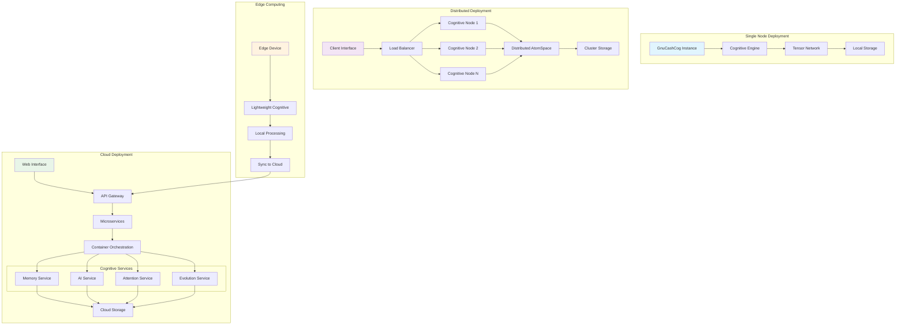

## Performance Monitoring Architecture

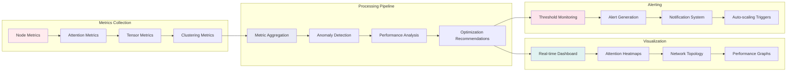

## Troubleshooting & FAQ

### 🔧 **Common Issues**

#### **Build Issues**
```bash
# ggml library not found
# Solution: Install ggml or use fallback mode
cmake -DHAVE_GGML=OFF ..

# OpenCog modules missing
# Solution: Install OpenCog dependencies
sudo apt-get install opencog-dev
```

#### **Runtime Issues**
```bash
# Tensor network initialization failed
# Check: OpenCog modules available
gnc_cognitive_accounting_init()

# Low performance
# Solution: Increase attention pool size
gnc_ecan_set_attention_pool_size(1000.0)
```

#### **Memory Issues**
```bash
# High memory usage
# Solution: Adjust tensor batch size
gnc_tensor_network_set_batch_size(network, 64)

# Memory leaks
# Solution: Enable debug mode
export GNC_COGNITIVE_DEBUG=1
```

### ❓ **Frequently Asked Questions**

**Q: How does the tensor network integrate with existing GnuCash?**
A: The tensor network runs alongside traditional accounting, providing enhanced cognitive capabilities while maintaining full backward compatibility.

**Q: Can I disable cognitive features?**
A: Yes, set `HAVE_COGNITIVE_ACCOUNTING=OFF` during build or use `--disable-cognitive` runtime flag.

**Q: What's the performance impact?**
A: Minimal for basic operations. Cognitive features add 10-20% overhead but provide significant analytical capabilities.

**Q: How do I monitor system performance?**
A: Use the built-in performance monitoring dashboard or integrate with external monitoring tools.

**Q: Can I run this on older hardware?**
A: Yes, the system automatically adapts to available resources with graceful degradation.

### 📊 **Performance Tuning Guide**

#### **Memory Optimization**
```c
// Reduce tensor cache size
gnc_tensor_network_set_cache_size(network, 256);

// Use memory pooling
gnc_tensor_network_enable_memory_pooling(network, TRUE);
```

#### **Processing Optimization**
```c
// Adjust message queue size
gnc_tensor_network_set_message_queue_size(network, 1000);

// Enable parallel processing
gnc_tensor_network_set_parallel_processing(network, TRUE);
```

#### **Attention Optimization**
```c
// Tune attention parameters
gnc_ecan_set_attention_decay_rate(0.9);
gnc_ecan_set_attention_update_frequency(100);
```

## Future Enhancements

1. **🚀 GPU Acceleration**: CUDA/OpenCL support for tensor operations
2. **🌐 Distributed Computing**: Multi-node network deployment
3. **🔮 Advanced Clustering**: Deep learning integration
4. **📡 Real-time Processing**: Streaming financial data support
5. **📊 Visualization**: Interactive network monitoring tools
6. **🤖 AutoML**: Automated model optimization
7. **🔐 Security**: Encrypted cognitive processing
8. **🌍 Multi-language**: International cognitive patterns
9. **🎯 Domain-specific**: Specialized financial verticals
10. **🧠 AGI Integration**: Artificial General Intelligence capabilities

### 🛣️ **Development Roadmap**

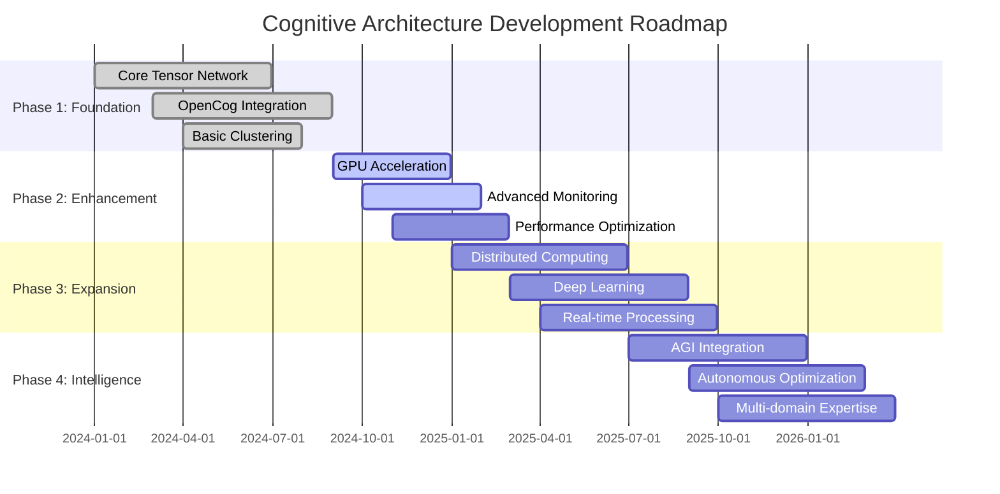

## Contributing

### 🤝 **How to Contribute**

1. **🍴 Fork** the repository
2. **🌿 Create** a feature branch
3. **🔨 Implement** cognitive enhancements
4. **✅ Test** thoroughly
5. **📝 Document** changes
6. **🚀 Submit** pull request

### 🎯 **Contribution Areas**

- **Core Architecture**: Tensor network improvements
- **Cognitive Algorithms**: Enhanced reasoning methods
- **Performance**: Optimization and scaling
- **Documentation**: Guides and examples
- **Testing**: Comprehensive test coverage
- **Integration**: OpenCog module enhancements

### 📋 **Code Standards**

- Follow existing code style
- Include comprehensive unit tests
- Document all public APIs
- Use meaningful variable names
- Optimize for readability and maintainability

## License

This tensor network implementation is licensed under the **GNU General Public License v2.0**, consistent with the GnuCash project.

### 📜 **License Summary**
- ✅ **Commercial Use**: Allowed
- ✅ **Modification**: Allowed
- ✅ **Distribution**: Allowed
- ✅ **Patent Use**: Allowed
- ❌ **Liability**: Limited
- ❌ **Warranty**: No warranty provided

See [LICENSE](LICENSE) file for complete terms.

---

*"The tensor network architecture represents the evolution of accounting from static record-keeping to dynamic cognitive intelligence, transforming financial data into actionable insights through the power of distributed neural-symbolic processing."*