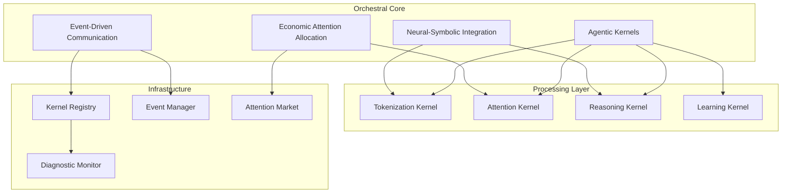

# Orchestral Architect Framework

A distributed agentic cognitive grammar system that transforms the OpenCog architecture into a self-organizing network of specialized cognitive kernels.

## Overview

The Orchestral Architect implements a sophisticated distributed cognitive processing system featuring:

- **Agentic Kernel Framework**: Base classes and interfaces for autonomous cognitive agents
- **Neural-Symbolic Integration**: Seamless bridge between symbolic reasoning and neural processing
- **Economic Attention Allocation**: ECAN-inspired market-based attention distribution
- **Event-Driven Communication**: Asynchronous kernel registry and coordination
- **Adaptive Processing**: Self-healing, diagnostic, and security capabilities

## Architecture



## Components

### Core Framework (`src/core/`)
- `AgenticKernel.h/.cpp` - Base kernel interface and implementation
- `KernelRegistry.h/.cpp` - Distributed kernel discovery and communication
- `EventManager.h/.cpp` - Asynchronous event processing system
- `NeuralSymbolicBridge.h/.cpp` - Integration layer for neural and symbolic processing

### Attention System (`src/attention/`)
- `EconomicAttentionEngine.h/.cpp` - Market-based attention allocation
- `AttentionMarket.h/.cpp` - Economic dynamics for resource distribution
- `SalienceCalculator.h/.cpp` - Multi-modal salience computation

### Processing Kernels (`src/kernels/`)
- `TokenizationKernel.h/.cpp` - Multi-strategy tokenization and parsing
- `AttentionKernel.h/.cpp` - Attention allocation and focusing
- `ReasoningKernel.h/.cpp` - Symbolic reasoning integration
- `LearningKernel.h/.cpp` - Adaptive learning and optimization

### Utilities (`src/utils/`)
- `CognitiveMetrics.h/.cpp` - Performance and cognitive measurement
- `SecurityMonitor.h/.cpp` - Active security and threat detection
- `DiagnosticEngine.h/.cpp` - Self-healing and system monitoring

## Demo Application

The `demo/` directory contains a working demonstration that shows:

1. **Live Tokenization**: Multi-strategy text processing with attention weighting
2. **Kernel Communication**: Event-driven coordination between specialized processors
3. **Economic Attention**: Dynamic resource allocation based on cognitive value
4. **Adaptive Processing**: Real-time optimization and performance feedback

## Integration

The framework integrates seamlessly with existing OpenCog components:

- **AtomSpace**: Knowledge representation and hypergraph storage
- **PLN**: Probabilistic reasoning and inference
- **ECAN**: Enhanced economic attention allocation
- **CogServer**: Network communication and distributed processing

## Usage

```cpp
#include "orchestral-architect/OrchestralSystem.h"

// Initialize the orchestral system
OrchestralSystem system;
system.initialize();

// Register specialized kernels
system.registerKernel(std::make_shared<TokenizationKernel>());
system.registerKernel(std::make_shared<AttentionKernel>());
system.registerKernel(std::make_shared<ReasoningKernel>());

// Process cognitive data
auto input = "hello world this is a simple test";
auto result = system.processInput(input);

// Display results
std::cout << "Processed: " << result.getProcessedText() << std::endl;
std::cout << "Attention weights: " << result.getAttentionWeights() << std::endl;
std::cout << "Processing cost: " << result.getCost() << std::endl;
```

## Building

```bash
mkdir build && cd build
cmake ..
make -j
```

## Testing

```bash
cd build
make test
```

## Documentation

Comprehensive documentation is available in the `docs/` directory:

- [Architecture Guide](docs/architecture.md)
- [API Reference](docs/api.md)
- [Kernel Development](docs/kernel-development.md)
- [Integration Guide](docs/integration.md)