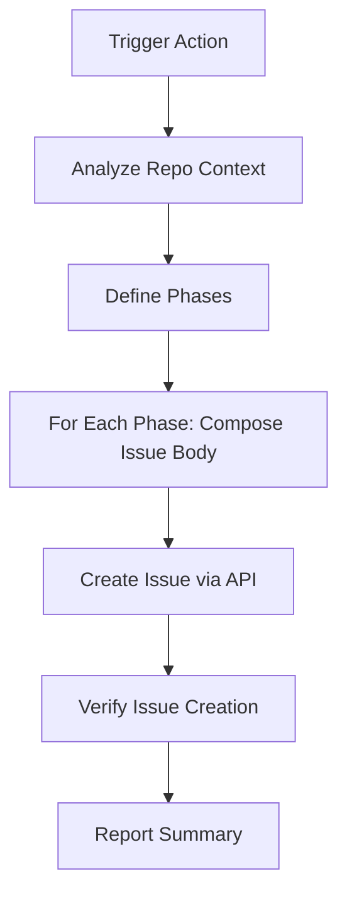

# Cognitive Architecture Issue Generator

This GitHub Action automatically generates comprehensive issues for each phase of the distributed cognitive architecture development.

## 🚀 How to Use

1. Go to the **Actions** tab in your GitHub repository
2. Click on **"Generate Distributed Cognitive Phase Issues"**
3. Click **"Run workflow"** 
4. Wait for the action to complete

## 📋 What It Creates

The action will create 6 detailed issues, one for each cognitive architecture phase:

1. **Phase 1**: Cognitive Primitives & Hypergraph Encoding
2. **Phase 2**: ECAN Attention Allocation & Resource Kernel  
3. **Phase 3**: Distributed Mesh Topology & Agent Orchestration
4. **Phase 4**: KoboldAI Integration & Cognitive Enhancement
5. **Phase 5**: Advanced Reasoning & Multi-Modal Cognition
6. **Phase 6**: Meta-Cognitive Learning & Adaptive Optimization

## 🎯 Each Issue Contains

- **Detailed Objectives**: Clear goals for the phase
- **Actionable Steps**: Specific tasks with checkboxes
- **Mermaid Flowcharts**: Visual cognitive workflow diagrams
- **Verification Protocols**: Testing and validation requirements
- **Labels**: Automatically tagged as `cognitive-architecture`, `enhancement`, `phase-implementation`

## 🔧 Technical Details

- **Trigger**: Manual workflow dispatch
- **Runtime**: ~30 seconds
- **Requirements**: GitHub repository with Actions enabled
- **Permissions**: Uses `GITHUB_TOKEN` to create issues

## 🪢 Cognitive Flowchart

This creates a living, distributed development environment where each cognitive phase becomes an actionable GitHub issue with rigorous detail and verification protocols.
