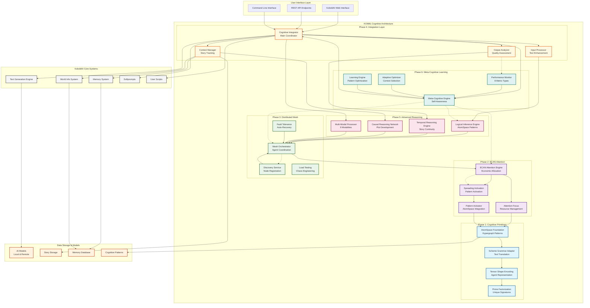

# KO6ML Architecture Overview

## Architecture Layers

### 🎯 User Interface Layer
Entry points for users and developers to interact with the cognitive architecture:
- **Web Interface**: Enhanced KoboldAI web UI with cognitive features
- **REST API**: Programmatic access to cognitive capabilities  
- **Command Line**: Direct CLI access for development and testing

### 🧠 Cognitive Processing Stack

#### Phase 6: Meta-Cognitive Learning (Top Layer)
Self-aware optimization and continuous improvement:
- **Performance Monitor**: Real-time system performance tracking
- **Adaptive Optimizer**: Context-aware algorithm selection
- **Learning Engine**: Continuous pattern learning and optimization
- **Meta-Cognitive Engine**: System self-awareness and adaptation

#### Phase 5: Advanced Reasoning
Sophisticated cognitive analysis capabilities:
- **Logical Inference**: Formal reasoning with AtomSpace patterns
- **Temporal Reasoning**: Story continuity and timeline analysis
- **Causal Networks**: Plot development and causal analysis
- **Multi-Modal Processor**: Cross-modal data integration

#### Phase 4: Integration Layer
Bridge between cognitive architecture and KoboldAI:
- **Cognitive Integrator**: Main coordination and orchestration
- **Input Processor**: Enhanced text input processing
- **Output Analyzer**: Quality assessment and analysis
- **Context Manager**: Story and character tracking

#### Phase 3: Distributed Mesh
Scalable distributed processing infrastructure:
- **Mesh Orchestrator**: Task distribution and coordination
- **Discovery Service**: Automatic node discovery and registration
- **Fault Tolerance**: Health monitoring and auto-recovery
- **Load Testing**: System resilience and chaos engineering

#### Phase 2: ECAN Attention
Economic attention allocation system:
- **ECAN Engine**: Intelligent resource allocation
- **Attention Focus**: Dynamic focus management
- **Spreading Activation**: Attention propagation
- **Pattern Activator**: AtomSpace integration

#### Phase 1: Cognitive Primitives (Foundation)
Core cognitive representation and processing:
- **AtomSpace**: Hypergraph knowledge representation
- **Scheme Adapter**: Text-to-pattern translation
- **Tensor Encoding**: Agent representation with unique signatures
- **Prime Factorization**: Collision-free identification

### 🔧 KoboldAI Core Systems
Original KoboldAI functionality enhanced with cognitive capabilities:
- **Text Generation**: AI model inference with cognitive enhancement
- **Memory System**: Story memory with cognitive context tracking
- **World Info**: Enhanced world information with cognitive patterns
- **Softprompts/Scripts**: Extended with cognitive capabilities

### 💾 Data Storage & Models
Persistent storage and model infrastructure:
- **AI Models**: Local and remote language models
- **Story Storage**: Enhanced story persistence with cognitive metadata
- **Memory Database**: Cognitive memory and context storage
- **Pattern Storage**: AtomSpace cognitive pattern repository

## Data Flow

### Input Processing Flow
1. **User Input** → Cognitive Integrator → Input Processor
2. **Text Translation** → Scheme Adapter → AtomSpace Patterns
3. **Attention Allocation** → ECAN Engine → Priority Assignment
4. **Task Distribution** → Mesh Orchestrator → Distributed Processing
5. **Reasoning Analysis** → Advanced Reasoning Engines → Insights
6. **Meta-Cognitive** → Performance Monitor → Optimization

### Output Generation Flow
1. **Enhanced Input** → Text Generation Engine → Raw Output
2. **Quality Analysis** → Output Analyzer → Quality Metrics
3. **Consistency Check** → Temporal Reasoning → Continuity Validation
4. **Context Update** → Context Manager → Story State Update
5. **Learning Update** → Learning Engine → Pattern Optimization
6. **Final Output** → User Interface → Enhanced Generated Text

### Feedback Loops
- **Performance Feedback**: Output quality → Performance Monitor → Adaptive Optimizer
- **Attention Feedback**: Processing results → ECAN Engine → Attention Reallocation
- **Learning Feedback**: User interaction → Learning Engine → Pattern Updates
- **Mesh Feedback**: Task completion → Mesh Orchestrator → Load Balancing

## Key Innovations

### 🎯 Cognitive Enhancement
- **Hypergraph Representation**: Rich knowledge structures beyond simple vectors
- **Economic Attention**: Intelligent resource allocation based on importance
- **Distributed Processing**: Scalable cognitive task distribution
- **Meta-Learning**: Self-aware system that improves its own performance

### 🚀 Performance Features
- **Real-time Processing**: Sub-second cognitive analysis
- **Fault Tolerance**: Robust error handling and auto-recovery
- **Scalable Architecture**: Linear scaling with additional resources
- **Memory Efficiency**: Optimized resource usage with intelligent caching

### 🔗 Integration Benefits
- **Seamless Operation**: Transparent enhancement of existing KoboldAI features
- **API Compatibility**: Full backward compatibility with existing integrations
- **Extensible Design**: Easy addition of new cognitive capabilities
- **Production Ready**: Comprehensive testing and validation

This architecture represents a significant advancement in AI-assisted writing, providing sophisticated cognitive capabilities while maintaining the accessibility and usability of the original KoboldAI system.