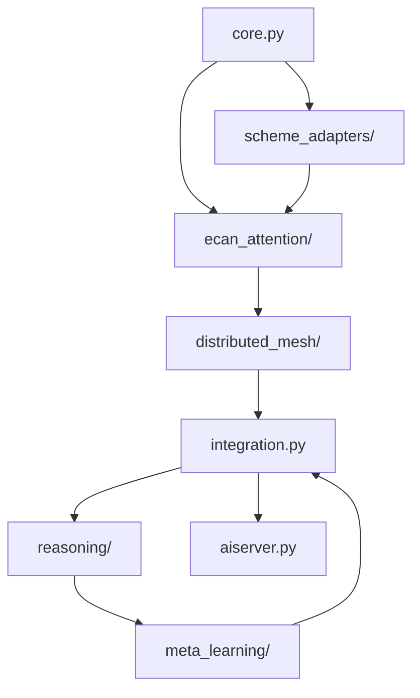

# KO6ML Developer Guide

## Welcome to KO6ML Development

This guide provides comprehensive information for developers who want to contribute to, extend, or integrate with the KO6ML Cognitive Architecture.

## Table of Contents

1. [Development Environment Setup](#development-environment-setup)
2. [Architecture Understanding](#architecture-understanding)
3. [Code Organization](#code-organization)
4. [Development Workflow](#development-workflow)
5. [Testing Framework](#testing-framework)
6. [Adding New Features](#adding-new-features)
7. [Performance Guidelines](#performance-guidelines)
8. [Documentation Standards](#documentation-standards)
9. [Contributing Guidelines](#contributing-guidelines)

## Development Environment Setup

### Prerequisites

```bash
# System requirements
Python 3.8+
Git 2.20+
4GB+ RAM (8GB+ recommended)
Multi-core CPU (4+ cores recommended)

# Development tools
pip install pytest pytest-cov black flake8 mypy
```

### Environment Setup

```bash
# Clone the repository
git clone https://github.com/OzCog/ko6ml.git
cd ko6ml

# Create virtual environment
python -m venv venv
source venv/bin/activate  # On Windows: venv\Scripts\activate

# Install dependencies
pip install numpy websockets aiohttp networkx pytest

# Verify installation
python test_phase1_requirements.py
python test_phase2_ecan_requirements.py
# ... run all phase tests
```

### IDE Configuration

#### VS Code Settings
```json
{
    "python.defaultInterpreterPath": "./venv/bin/python",
    "python.testing.pytestEnabled": true,
    "python.testing.pytestArgs": ["."],
    "python.linting.enabled": true,
    "python.linting.flake8Enabled": true,
    "python.formatting.provider": "black"
}
```

#### PyCharm Configuration
- Set Python interpreter to `./venv/bin/python`
- Enable pytest as test runner
- Configure Black as code formatter
- Enable Flake8 as linter

## Architecture Understanding

### Core Concepts

#### 1. Cognitive Primitives (Phase 1)
```python
# AtomSpace patterns represent knowledge
from cognitive_architecture.scheme_adapters import SchemeGrammarAdapter

adapter = SchemeGrammarAdapter()
patterns = adapter.translate_kobold_to_atomspace("The hero saves the village")
# Results in: [(ConceptNode "hero"), (PredicateNode "saves"), (ConceptNode "village")]
```

#### 2. Economic Attention (Phase 2)
```python
# ECAN allocates attention based on importance
from cognitive_architecture.ecan_attention import EconomicAttentionNetwork

ecan = EconomicAttentionNetwork()
ecan.register_cognitive_element("hero", initial_sti=100.0)
focus = ecan.get_attention_focus()  # Returns most important elements
```

#### 3. Distributed Processing (Phase 3)
```python
# Mesh orchestrator distributes cognitive tasks
from cognitive_architecture.distributed_mesh import mesh_orchestrator

task_id = mesh_orchestrator.submit_task(cognitive_task)
status = mesh_orchestrator.get_task_status(task_id)
```

### Design Patterns

#### 1. Component Registration Pattern
```python
class NewCognitiveComponent:
    def __init__(self):
        self.component_id = "new_component"
        self.capabilities = {"text_analysis", "pattern_recognition"}
    
    def register(self):
        # Register with integration system
        kobold_cognitive_integrator.register_component(self.component_id, self)
    
    def process(self, data):
        # Component-specific processing logic
        return processed_data
```

#### 2. Event-Driven Processing
```python
from cognitive_architecture.events import CognitiveEventManager

class EventDrivenComponent:
    def __init__(self):
        CognitiveEventManager.subscribe('attention_allocated', self.on_attention)
        CognitiveEventManager.subscribe('task_completed', self.on_task_complete)
    
    def on_attention(self, event):
        # React to attention allocation changes
        pass
    
    def on_task_complete(self, event):
        # React to task completion
        pass
```

#### 3. Performance Monitoring Pattern
```python
from cognitive_architecture.meta_learning import PerformanceMonitor

class MonitoredComponent:
    def __init__(self):
        self.monitor = PerformanceMonitor()
    
    def process_with_monitoring(self, data):
        start_time = time.time()
        try:
            result = self.process(data)
            self.monitor.record_processing_time(
                "process", time.time() - start_time, "component"
            )
            self.monitor.record_accuracy(result.confidence, "task", "component")
            return result
        except Exception as e:
            self.monitor.record_error("process", str(e), "component")
            raise
```

## Code Organization

### Directory Structure

```
ko6ml/
├── cognitive_architecture/          # Core cognitive architecture
│   ├── core.py                     # Phase 1: Basic cognitive structures
│   ├── scheme_adapters/            # Phase 1: Text-to-pattern translation
│   ├── ecan_attention/             # Phase 2: Attention allocation
│   ├── distributed_mesh/           # Phase 3: Distributed processing
│   ├── integration.py              # Phase 4: KoboldAI integration
│   ├── reasoning/                  # Phase 5: Advanced reasoning
│   └── meta_learning/              # Phase 6: Meta-cognitive learning
├── test_phase*_requirements.py     # Phase validation tests
├── phase*_demonstration.py         # Phase demonstration scripts
├── docs/                           # Documentation
├── static/                         # Web UI resources
├── templates/                      # Web UI templates
└── aiserver.py                     # Main KoboldAI server
```

### Module Dependencies



### Naming Conventions

#### Classes
```python
# Use PascalCase for classes
class CognitiveAgent:
    pass

class EconomicAttentionNetwork:
    pass

class MetaCognitiveEngine:
    pass
```

#### Functions and Variables
```python
# Use snake_case for functions and variables
def process_cognitive_input(text_input):
    attention_score = calculate_attention_value()
    return enhanced_output

cognitive_elements = []
processing_time = 0.0
```

#### Constants
```python
# Use UPPER_CASE for constants
DEFAULT_STI_BUDGET = 1000
MAX_ATTENTION_ELEMENTS = 100
PROCESSING_TIMEOUT_SECONDS = 30.0
```

## Development Workflow

### 1. Feature Development Process

```bash
# Create feature branch
git checkout -b feature/new-cognitive-component

# Implement feature following patterns
# 1. Create component in appropriate phase directory
# 2. Add integration with existing systems
# 3. Write comprehensive tests
# 4. Add documentation

# Run tests
python -m pytest test_*.py -v

# Format code
black cognitive_architecture/
flake8 cognitive_architecture/

# Commit changes
git add .
git commit -m "Add new cognitive component with integration tests"

# Push and create PR
git push origin feature/new-cognitive-component
```

### 2. Testing Strategy

#### Unit Tests
```python
import unittest
from cognitive_architecture.your_module import YourComponent

class TestYourComponent(unittest.TestCase):
    def setUp(self):
        self.component = YourComponent()
    
    def test_basic_functionality(self):
        result = self.component.process("test input")
        self.assertIsNotNone(result)
        self.assertGreater(result.confidence, 0.0)
    
    def test_error_handling(self):
        with self.assertRaises(ValueError):
            self.component.process(None)
```

#### Integration Tests
```python
def test_cognitive_integration():
    # Test full cognitive pipeline
    from cognitive_architecture.integration import kobold_cognitive_integrator
    
    # Initialize system
    success = kobold_cognitive_integrator.initialize()
    assert success
    
    # Process input through full pipeline
    input_text = "The wizard casts a powerful spell"
    result = kobold_cognitive_integrator.process_input(input_text)
    
    # Verify cognitive enhancement occurred
    assert len(result) > len(input_text)  # Enhanced input
    
    # Verify all phases participated
    status = kobold_cognitive_integrator.get_integration_status()
    assert status['phase1_active']
    assert status['phase2_active']
    # ... check all phases
```

#### Performance Tests
```python
import time

def test_processing_performance():
    start_time = time.time()
    
    # Process multiple inputs
    for i in range(100):
        result = component.process(f"test input {i}")
    
    end_time = time.time()
    avg_time = (end_time - start_time) / 100
    
    # Verify performance requirements
    assert avg_time < 0.1  # Sub-100ms processing
```

## Testing Framework

### Phase Validation Tests

Each phase has comprehensive validation tests:

```python
# test_phase1_requirements.py - Example structure
def test_scheme_adapters():
    """Test Scheme adapters for agentic grammar AtomSpace"""
    # Implementation

def test_round_trip_translations():
    """Test round-trip translation tests (no mocks)"""
    # Implementation

def test_tensor_shape_encoding():
    """Test agent/state encoding as hypergraph nodes/links"""
    # Implementation

# Similar structure for all phases
```

### Running Tests

```bash
# Run all tests
python -m pytest test_*.py -v

# Run specific phase tests
python test_phase1_requirements.py
python test_phase2_ecan_requirements.py

# Run with coverage
python -m pytest --cov=cognitive_architecture test_*.py

# Run performance benchmarks
python -m pytest -k "performance" -v
```

### Test Data and Fixtures

```python
# Create test data factories
class TestDataFactory:
    @staticmethod
    def create_test_story():
        return {
            'text': 'A brave knight embarks on a quest...',
            'characters': [{'name': 'Knight', 'role': 'protagonist'}],
            'events': [{'description': 'Quest begins', 'participants': ['Knight']}]
        }
    
    @staticmethod
    def create_test_cognitive_element():
        return {
            'element_id': 'test_element',
            'sti': 50.0,
            'lti': 30.0,
            'capabilities': ['text_processing']
        }
```

## Adding New Features

### 1. Adding a New Cognitive Component

#### Step 1: Define Component Interface
```python
# cognitive_architecture/new_feature/component.py
from abc import ABC, abstractmethod

class CognitiveComponent(ABC):
    @abstractmethod
    def initialize(self) -> bool:
        pass
    
    @abstractmethod
    def process(self, data: Any) -> Any:
        pass
    
    @abstractmethod
    def get_status(self) -> Dict[str, Any]:
        pass

class NewCognitiveComponent(CognitiveComponent):
    def __init__(self):
        self.component_id = "new_component"
        self.initialized = False
    
    def initialize(self) -> bool:
        # Initialization logic
        self.initialized = True
        return True
    
    def process(self, data: Any) -> Any:
        if not self.initialized:
            raise RuntimeError("Component not initialized")
        
        # Processing logic
        return processed_data
    
    def get_status(self) -> Dict[str, Any]:
        return {
            'component_id': self.component_id,
            'initialized': self.initialized,
            'processing_count': getattr(self, 'processing_count', 0)
        }
```

#### Step 2: Integration with Existing Systems
```python
# cognitive_architecture/integration.py - Add to existing integrator
class KoboldCognitiveIntegrator:
    def __init__(self):
        # ... existing initialization
        self.new_component = None
    
    def initialize(self) -> bool:
        # ... existing initialization
        
        # Initialize new component
        try:
            from cognitive_architecture.new_feature import NewCognitiveComponent
            self.new_component = NewCognitiveComponent()
            success = self.new_component.initialize()
            if not success:
                logger.error("Failed to initialize new component")
                return False
        except Exception as e:
            logger.error(f"Error initializing new component: {e}")
            return False
        
        return True
    
    def process_input(self, text: str, context: Dict[str, Any] = None) -> str:
        # ... existing processing
        
        # Add new component processing
        if self.new_component and self.new_component.initialized:
            try:
                enhanced_data = self.new_component.process(text)
                # Integrate enhanced data into pipeline
            except Exception as e:
                logger.warning(f"New component processing failed: {e}")
        
        return enhanced_text
```

#### Step 3: Add Tests
```python
# test_new_component.py
import unittest
from cognitive_architecture.new_feature import NewCognitiveComponent

class TestNewCognitiveComponent(unittest.TestCase):
    def setUp(self):
        self.component = NewCognitiveComponent()
    
    def test_initialization(self):
        success = self.component.initialize()
        self.assertTrue(success)
        self.assertTrue(self.component.initialized)
    
    def test_processing(self):
        self.component.initialize()
        result = self.component.process("test data")
        self.assertIsNotNone(result)
    
    def test_integration(self):
        from cognitive_architecture.integration import kobold_cognitive_integrator
        # Test integration with main system
        pass

if __name__ == '__main__':
    unittest.main()
```

### 2. Adding New Reasoning Capabilities

```python
# cognitive_architecture/reasoning/new_reasoning.py
from cognitive_architecture.reasoning.inference import InferenceRule, InferenceType

class NewReasoningEngine:
    def __init__(self):
        self.reasoning_rules = []
        self.initialized = False
    
    def add_reasoning_rule(self, rule: InferenceRule) -> bool:
        """Add a new reasoning rule"""
        if rule.rule_id in [r.rule_id for r in self.reasoning_rules]:
            return False  # Rule already exists
        
        self.reasoning_rules.append(rule)
        return True
    
    def reason_about_data(self, data: Dict[str, Any]) -> Dict[str, Any]:
        """Apply reasoning rules to data"""
        results = {
            'conclusions': [],
            'confidence': 0.0,
            'reasoning_path': []
        }
        
        for rule in self.reasoning_rules:
            if self._rule_applies(rule, data):
                conclusion = self._apply_rule(rule, data)
                results['conclusions'].append(conclusion)
                results['reasoning_path'].append(rule.rule_id)
        
        # Calculate overall confidence
        if results['conclusions']:
            results['confidence'] = sum(c['confidence'] for c in results['conclusions']) / len(results['conclusions'])
        
        return results
    
    def _rule_applies(self, rule: InferenceRule, data: Dict[str, Any]) -> bool:
        # Check if rule premises are satisfied
        return True  # Implement rule application logic
    
    def _apply_rule(self, rule: InferenceRule, data: Dict[str, Any]) -> Dict[str, Any]:
        # Apply rule and return conclusion
        return {
            'rule_id': rule.rule_id,
            'conclusion': rule.conclusion,
            'confidence': rule.confidence
        }

# Integration with advanced reasoning engine
from cognitive_architecture.reasoning import advanced_reasoning_engine

def setup_new_reasoning():
    new_engine = NewReasoningEngine()
    
    # Add to advanced reasoning engine
    advanced_reasoning_engine.register_reasoning_engine('new_reasoning', new_engine)
    
    return new_engine
```

### 3. Adding Meta-Learning Patterns

```python
# cognitive_architecture/meta_learning/new_patterns.py
from cognitive_architecture.meta_learning import CognitivePattern, PatternType

class CustomPatternLearner:
    def __init__(self):
        self.custom_patterns = {}
    
    def learn_custom_pattern(self, pattern_data: Dict[str, Any]) -> bool:
        """Learn a new custom pattern"""
        pattern = CognitivePattern(
            pattern_id=f"custom_{len(self.custom_patterns)}",
            pattern_type=PatternType.CUSTOM,
            pattern_data=pattern_data,
            effectiveness_score=0.5  # Initial score
        )
        
        # Add to meta-learning system
        from cognitive_architecture.meta_learning import meta_cognitive_engine
        success = meta_cognitive_engine.learning_engine.pattern_learner.learn_pattern(pattern)
        
        if success:
            self.custom_patterns[pattern.pattern_id] = pattern
        
        return success
    
    def optimize_custom_patterns(self) -> Dict[str, float]:
        """Optimize all custom patterns"""
        optimization_results = {}
        
        for pattern_id, pattern in self.custom_patterns.items():
            # Get pattern usage statistics
            stats = meta_cognitive_engine.learning_engine.pattern_learner.get_pattern_usage_stats(pattern_id)
            
            if stats['usage_count'] > 10:  # Enough data for optimization
                # Optimize based on performance
                if stats['average_effectiveness'] > pattern.effectiveness_score:
                    pattern.effectiveness_score = stats['average_effectiveness']
                    optimization_results[pattern_id] = stats['average_effectiveness']
        
        return optimization_results
```

## Performance Guidelines

### 1. Processing Time Requirements

- **Phase 1 (AtomSpace)**: < 0.01s per pattern operation
- **Phase 2 (ECAN)**: < 0.001s per attention cycle
- **Phase 3 (Mesh)**: < 0.1s per task distribution
- **Phase 4 (Integration)**: < 0.1s per text processing
- **Phase 5 (Reasoning)**: < 0.01s per analysis
- **Phase 6 (Meta-Learning)**: < 1.0s per meta-cognitive cycle

### 2. Memory Usage Guidelines

```python
# Use memory-efficient data structures
from collections import deque
import weakref

class MemoryEfficientComponent:
    def __init__(self, max_history: int = 1000):
        # Use deque for fixed-size history
        self.processing_history = deque(maxlen=max_history)
        
        # Use weak references for temporary objects
        self._temp_references = weakref.WeakSet()
        
        # Implement caching with size limits
        self._cache = {}
        self._cache_max_size = 100
    
    def add_to_cache(self, key: str, value: Any):
        if len(self._cache) >= self._cache_max_size:
            # Remove oldest entry
            oldest_key = next(iter(self._cache))
            del self._cache[oldest_key]
        
        self._cache[key] = value
```

### 3. Asynchronous Processing

```python
import asyncio
from typing import Awaitable

class AsyncCognitiveComponent:
    async def process_async(self, data: Any) -> Any:
        """Asynchronous processing for non-blocking operations"""
        # Start processing tasks concurrently
        tasks = [
            self._analyze_async(data),
            self._enhance_async(data),
            self._validate_async(data)
        ]
        
        # Wait for all tasks to complete
        results = await asyncio.gather(*tasks, return_exceptions=True)
        
        # Handle any exceptions
        valid_results = [r for r in results if not isinstance(r, Exception)]
        
        return self._combine_results(valid_results)
    
    async def _analyze_async(self, data: Any) -> Any:
        # Implement async analysis
        await asyncio.sleep(0.01)  # Simulate processing
        return {"analysis": "result"}
    
    async def _enhance_async(self, data: Any) -> Any:
        # Implement async enhancement
        await asyncio.sleep(0.01)  # Simulate processing
        return {"enhancement": "result"}
    
    async def _validate_async(self, data: Any) -> Any:
        # Implement async validation
        await asyncio.sleep(0.01)  # Simulate processing
        return {"validation": "result"}
```

## Documentation Standards

### 1. Code Documentation

```python
class ExampleComponent:
    """
    Example cognitive component demonstrating documentation standards.
    
    This component provides template functionality for new cognitive
    components in the KO6ML architecture.
    
    Attributes:
        component_id (str): Unique identifier for the component
        initialized (bool): Whether the component has been initialized
        processing_count (int): Number of items processed
    
    Example:
        >>> component = ExampleComponent()
        >>> component.initialize()
        True
        >>> result = component.process("test data")
        >>> print(result)
        {'processed': True, 'data': 'enhanced test data'}
    """
    
    def __init__(self, component_id: str = "example"):
        """
        Initialize the example component.
        
        Args:
            component_id (str): Unique identifier for this component instance
        """
        self.component_id = component_id
        self.initialized = False
        self.processing_count = 0
    
    def process(self, data: str) -> Dict[str, Any]:
        """
        Process input data with cognitive enhancement.
        
        Args:
            data (str): Input data to process
            
        Returns:
            Dict[str, Any]: Processed data with enhancements
            
        Raises:
            RuntimeError: If component is not initialized
            ValueError: If data is invalid
            
        Example:
            >>> component = ExampleComponent()
            >>> component.initialize()
            >>> result = component.process("hello world")
            >>> result['processed']
            True
        """
        if not self.initialized:
            raise RuntimeError("Component must be initialized before processing")
        
        if not data or not isinstance(data, str):
            raise ValueError("Data must be a non-empty string")
        
        # Processing logic
        processed_data = {
            'processed': True,
            'data': f"enhanced {data}",
            'component_id': self.component_id,
            'processing_number': self.processing_count
        }
        
        self.processing_count += 1
        return processed_data
```

### 2. API Documentation

```python
# Use clear type hints and detailed docstrings
from typing import List, Dict, Any, Optional, Union

def comprehensive_api_function(
    input_data: Union[str, List[str]],
    processing_options: Optional[Dict[str, Any]] = None,
    timeout: float = 30.0
) -> Dict[str, Any]:
    """
    Comprehensive API function demonstrating documentation standards.
    
    This function processes input data using the cognitive architecture
    and returns enhanced results with metadata.
    
    Args:
        input_data (Union[str, List[str]]): Input text or list of texts to process
        processing_options (Optional[Dict[str, Any]]): Configuration options
            for processing. Supported keys:
            - 'enable_reasoning' (bool): Enable advanced reasoning (default: True)
            - 'attention_threshold' (float): Minimum attention threshold (default: 0.5)
            - 'max_processing_time' (float): Maximum processing time (default: 10.0)
        timeout (float): Maximum time to wait for processing completion
    
    Returns:
        Dict[str, Any]: Processing results containing:
            - 'processed_data' (List[str]): Enhanced input data
            - 'processing_time' (float): Time taken for processing
            - 'confidence' (float): Overall confidence in results
            - 'metadata' (Dict[str, Any]): Additional processing metadata
    
    Raises:
        ValueError: If input_data is invalid
        TimeoutError: If processing exceeds timeout
        CognitiveArchitectureError: If cognitive processing fails
    
    Example:
        >>> result = comprehensive_api_function(
        ...     "The hero begins their quest",
        ...     {'enable_reasoning': True, 'attention_threshold': 0.7}
        ... )
        >>> print(result['confidence'])
        0.85
        >>> print(len(result['processed_data']))
        1
    """
    # Implementation
    pass
```

## Contributing Guidelines

### 1. Code Review Process

#### Pull Request Checklist
- [ ] All tests pass (`python -m pytest test_*.py`)
- [ ] Code follows style guidelines (`black` and `flake8` clean)
- [ ] New features have comprehensive tests (>90% coverage)
- [ ] Documentation is updated
- [ ] Performance requirements are met
- [ ] Integration with existing phases is tested

#### Review Criteria
1. **Functionality**: Does the code work as intended?
2. **Performance**: Does it meet performance requirements?
3. **Integration**: Does it integrate properly with existing systems?
4. **Testing**: Are there sufficient tests?
5. **Documentation**: Is it well documented?
6. **Code Quality**: Is the code clean and maintainable?

### 2. Issue Reporting

#### Bug Reports
```markdown
**Bug Description**
Clear description of the bug

**Steps to Reproduce**
1. Step 1
2. Step 2
3. Step 3

**Expected Behavior**
What should happen

**Actual Behavior**
What actually happens

**Environment**
- OS: 
- Python version:
- KO6ML version:
- Dependencies:

**Additional Context**
Any additional information
```

#### Feature Requests
```markdown
**Feature Description**
Clear description of the proposed feature

**Use Case**
Why is this feature needed?

**Proposed Implementation**
How should this be implemented?

**Impact Assessment**
- Performance impact:
- Integration requirements:
- Breaking changes:

**Additional Context**
Any additional information
```

### 3. Release Process

#### Version Numbering
- **Major** (x.0.0): Breaking changes, new phase implementations
- **Minor** (x.y.0): New features, significant enhancements
- **Patch** (x.y.z): Bug fixes, minor improvements

#### Release Checklist
- [ ] All tests pass on all supported platforms
- [ ] Performance benchmarks meet requirements
- [ ] Documentation is updated
- [ ] Change log is updated
- [ ] Version numbers are bumped
- [ ] Release notes are prepared

## Getting Help

### Resources
- **Technical Documentation**: [TECHNICAL_DOCUMENTATION.md](TECHNICAL_DOCUMENTATION.md)
- **API Reference**: [API_DOCUMENTATION.md](API_DOCUMENTATION.md)
- **Architecture Overview**: [ARCHITECTURE_OVERVIEW.md](ARCHITECTURE_OVERVIEW.md)

### Community
- **GitHub Issues**: Report bugs and request features
- **Discussions**: Ask questions and share ideas
- **Code Review**: Participate in code reviews

### Support
For development questions and support:
1. Check existing documentation
2. Search GitHub issues
3. Create a new issue with detailed information
4. Participate in community discussions

This developer guide provides the foundation for contributing to KO6ML. The cognitive architecture is designed to be extensible and welcomes contributions that enhance its capabilities while maintaining its performance and integration standards.