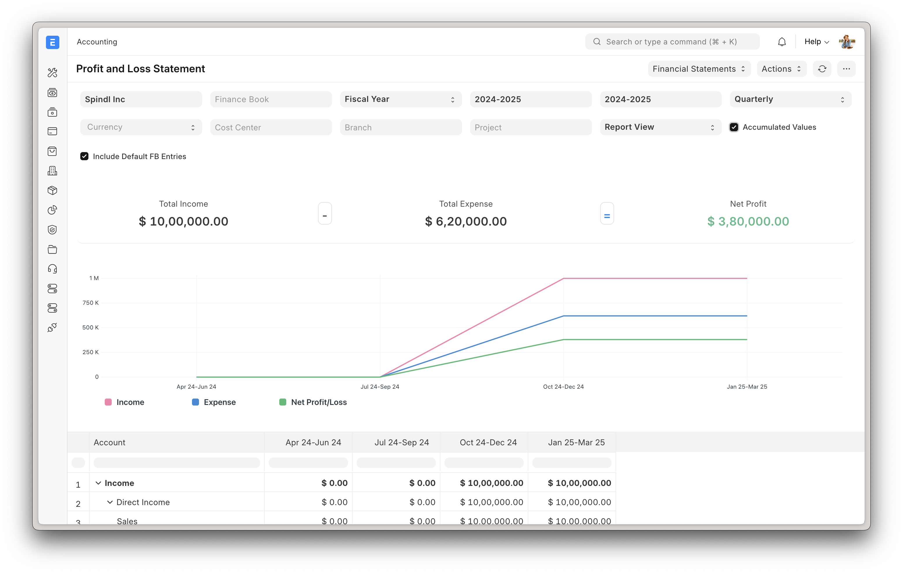

<div align="center">
    <a href="https://frappe.io/erpnext">
	
    </a>
    <h2>ERPNext</h2>
    <p align="center">
        <p>Powerful, Intuitive and Open-Source ERP</p>
    </p>

[](https://frappe.school)<br><br>
[](https://github.com/frappe/erpnext/actions/workflows/server-tests-mariadb.yml)
[](https://hub.docker.com/r/frappe/erpnext-worker)

</div>

<div align="center">
	
</div>

<div align="center">
	<a href="https://erpnext-demo.frappe.cloud/api/method/erpnext_demo.erpnext_demo.auth.login_demo">Live Demo</a>
	-
	<a href="https://frappe.io/erpnext">Website</a>
	-
	<a href="https://docs.frappe.io/erpnext/">Documentation</a>
</div>

## ERPNext

100% Open-Source ERP system to help you run your business.

### Motivation

Running a business is a complex task - handling invoices, tracking stock, managing personnel and even more ad-hoc activities. In a market where software is sold separately to manage each of these tasks, ERPNext does all of the above and more, for free.

### Key Features

- **Accounting**: All the tools you need to manage cash flow in one place, right from recording transactions to summarizing and analyzing financial reports.
- **Order Management**: Track inventory levels, replenish stock, and manage sales orders, customers, suppliers, shipments, deliverables, and order fulfillment.
- **Manufacturing**: Simplifies the production cycle, helps track material consumption, exhibits capacity planning, handles subcontracting, and more!
- **Asset Management**: From purchase to perishment, IT infrastructure to equipment. Cover every branch of your organization, all in one centralized system.
- **Projects**: Delivery both internal and external Projects on time, budget and Profitability. Track tasks, timesheets, and issues by project.

<details open>

<summary>More</summary>
	
	
	
	
</details>

### Under the Hood

- [**Frappe Framework**](https://github.com/frappe/frappe): A full-stack web application framework written in Python and Javascript. The framework provides a robust foundation for building web applications, including a database abstraction layer, user authentication, and a REST API.

- [**Frappe UI**](https://github.com/frappe/frappe-ui): A Vue-based UI library, to provide a modern user interface. The Frappe UI library provides a variety of components that can be used to build single-page applications on top of the Frappe Framework.

## Production Setup

### Managed Hosting

You can try [Frappe Cloud](https://frappecloud.com), a simple, user-friendly and sophisticated [open-source](https://github.com/frappe/press) platform to host Frappe applications with peace of mind.

It takes care of installation, setup, upgrades, monitoring, maintenance and support of your Frappe deployments. It is a fully featured developer platform with an ability to manage and control multiple Frappe deployments.

<div>
	<a href="https://erpnext-demo.frappe.cloud/app/home" target="_blank">
		<picture>
			<source media="(prefers-color-scheme: dark)" srcset="https://frappe.io/files/try-on-fc-white.png">
			
		</picture>
	</a>
</div>


### Self-Hosted

#### Docker

Prerequisites: docker, docker-compose, git. Refer [Docker Documentation](https://docs.docker.com) for more details on Docker setup.

Run following commands:

```
git clone https://github.com/frappe/frappe_docker
cd frappe_docker
docker compose -f pwd.yml up -d
```

After a couple of minutes, site should be accessible on your localhost port: 8080. Use below default login credentials to access the site.
- Username: Administrator
- Password: admin

See [Frappe Docker](https://github.com/frappe/frappe_docker?tab=readme-ov-file#to-run-on-arm64-architecture-follow-this-instructions) for ARM based docker setup.

#### Local Production Deployment

For local production deployment with proper web server and process management:

**Quick Deployment**

Use our automated deployment script:

```bash
# After completing the development setup, run:
./scripts/local_deploy.sh --site-name your-domain.com --ssl
```

**Manual Production Setup**

1. **Switch to Production Mode**
   ```bash
   cd frappe-bench
   bench --site your-site.local set-config developer_mode 0
   bench --site your-site.local set-config server_script_enabled 0
   bench build --production
   ```

2. **Setup Nginx**
   ```bash
   # Install nginx
   sudo apt-get install -y nginx

   # Generate nginx configuration
   bench setup nginx

   # Enable site
   sudo ln -s /home/$(whoami)/frappe-bench/config/nginx.conf /etc/nginx/sites-enabled/frappe-bench
   sudo systemctl restart nginx
   ```

3. **Setup Supervisor**
   ```bash
   # Install supervisor
   sudo apt-get install -y supervisor

   # Generate supervisor configuration
   bench setup supervisor

   # Enable and start supervisor
   sudo ln -s /home/$(whoami)/frappe-bench/config/supervisor.conf /etc/supervisor/conf.d/frappe-bench.conf
   sudo systemctl restart supervisor
   ```

4. **Setup SSL (Optional)**
   ```bash
   # Install certbot
   sudo apt-get install -y certbot python3-certbot-nginx

   # Get SSL certificate
   sudo certbot --nginx -d your-domain.com
   ```

5. **Setup Automated Backups**
   ```bash
   # Create backup directory
   sudo mkdir -p /var/backups/frappe-bench
   sudo chown -R $(whoami):$(whoami) /var/backups/frappe-bench

   # Setup daily backup cron job
   crontab -e
   # Add this line:
   # 0 2 * * * cd /home/$(whoami)/frappe-bench && bench --site your-site.local backup --with-files && mv sites/your-site.local/backups/* /var/backups/frappe-bench/
   ```

**Production Configuration**

Use our production configuration template:

```bash
# Copy production configuration
cp config/templates/site_config_production.json sites/your-site.local/site_config.json
cp config/templates/.env.production .env

# Edit configuration files
nano sites/your-site.local/site_config.json
nano .env
```

**Security Checklist**

- [ ] Change default admin password
- [ ] Enable HTTPS/SSL
- [ ] Configure firewall (ufw/iptables)
- [ ] Setup fail2ban for intrusion prevention
- [ ] Regular security updates
- [ ] Database user with limited privileges
- [ ] Regular backups with encryption
- [ ] Monitor log files for suspicious activity

**Monitoring and Maintenance**

```bash
# Check service status
sudo supervisorctl status

# View logs
tail -f frappe-bench/logs/web.log
tail -f frappe-bench/logs/worker.log

# Update system
bench update

# Manual backup
bench --site your-site.local backup --with-files

# Restart services
sudo supervisorctl restart all
```


## Development Setup
### Manual Install

The Easy Way: our install script for bench will install all dependencies (e.g. MariaDB). See https://github.com/frappe/bench for more details.

New passwords will be created for the ERPNext "Administrator" user, the MariaDB root user, and the frappe user (the script displays the passwords and saves them to ~/frappe_passwords.txt).

### Local Installation & Setup

We provide automated scripts to make local installation and deployment easier. Choose the method that best fits your needs:

#### Quick Start (Recommended)

Use our automated installation script for a hassle-free setup:

```bash
# Download and run the installation script
curl -fsSL https://raw.githubusercontent.com/OzCog/mlpn/develop/scripts/local_install.sh | bash

# Or clone the repository and run locally
git clone https://github.com/OzCog/mlpn.git
cd mlpn
./scripts/local_install.sh --dev
```

#### Manual Installation

For more control over the installation process:

1. **Install System Dependencies**
   ```bash
   # Ubuntu/Debian
   sudo apt-get update
   sudo apt-get install -y python3-dev python3-pip python3-venv redis-server mariadb-server \
                          mariadb-client libmariadb-dev libffi-dev libssl-dev wkhtmltopdf curl \
                          git npm nodejs libcups2-dev

   # CentOS/RHEL/Fedora
   sudo yum install -y python3-devel python3-pip redis mariadb-server mariadb-devel \
                       libffi-devel openssl-devel wkhtmltopdf curl git npm nodejs cups-devel

   # macOS (with Homebrew)
   brew install python3 redis mariadb node npm wkhtmltopdf
   ```

2. **Setup Database**
   ```bash
   # Start MariaDB
   sudo systemctl start mariadb
   sudo systemctl enable mariadb

   # Secure MariaDB installation
   sudo mysql_secure_installation

   # Create database and user
   sudo mysql -u root -p -e "CREATE DATABASE erpnext_local;"
   sudo mysql -u root -p -e "CREATE USER 'erpnext_local'@'localhost' IDENTIFIED BY 'erpnext_local';"
   sudo mysql -u root -p -e "GRANT ALL PRIVILEGES ON erpnext_local.* TO 'erpnext_local'@'localhost';"
   sudo mysql -u root -p -e "FLUSH PRIVILEGES;"
   ```

3. **Install frappe-bench**
   ```bash
   pip3 install --user frappe-bench
   export PATH="$HOME/.local/bin:$PATH"
   ```

4. **Initialize Bench and Install ERPNext**
   ```bash
   # Initialize bench
   bench init frappe-bench
   cd frappe-bench

   # Create a new site
   bench new-site erpnext.local --db-name erpnext_local --admin-password admin

   # Get ERPNext app
   bench get-app https://github.com/OzCog/mlpn

   # Install ERPNext
   bench --site erpnext.local install-app erpnext

   # Start the server
   bench start
   ```

5. **Access Your Site**
   - Open `http://erpnext.local:8000` in your browser
   - Login with: Administrator / admin

#### Configuration Templates

We provide pre-configured templates for different environments:

```bash
# Copy configuration templates
cp config/templates/.env.local .env
cp config/templates/site_config_local.json sites/erpnext.local/site_config.json

# Edit the configuration files as needed
nano .env
nano sites/erpnext.local/site_config.json
```

#### Troubleshooting

**Common Issues:**

1. **Permission Errors**: Make sure your user has proper permissions
   ```bash
   sudo chown -R $(whoami):$(whoami) frappe-bench
   ```

2. **Database Connection Issues**: Check MariaDB is running and credentials are correct
   ```bash
   sudo systemctl status mariadb
   mysql -u erpnext_local -p -e "SELECT 1;"
   ```

3. **Port Already in Use**: Change the port or stop the conflicting service
   ```bash
   bench config set webserver_port 8001
   ```

4. **Node.js/npm Issues**: Ensure you have the latest LTS version
   ```bash
   node --version  # Should be >= 18.x
   npm --version   # Should be >= 8.x
   ```

**For more detailed troubleshooting, see our [Troubleshooting Guide](docs/troubleshooting.md)**

#### Quick Start Examples

**Development Setup:**
```bash
# Clone and setup for development
git clone https://github.com/OzCog/mlpn.git
cd mlpn
make quick-setup

# Or using the installation script
./scripts/local_install.sh --dev

# Or using the Python helper
python3 setup.py full-setup --dev
```

**Production Deployment:**
```bash
# After development setup, deploy to production
make production-setup

# Or using the deployment script
./scripts/local_deploy.sh --site-name your-domain.com --ssl
```

**Common Tasks:**
```bash
# Start development server
make start

# Create backup
make backup

# Update system
make update

# Check system status
make status

# View logs
make logs

# Run tests
make test
```

**Complete Installation Guide:** See [docs/installation.md](docs/installation.md) for comprehensive instructions.

## Learning and community

1. [Frappe School](https://school.frappe.io) - Learn Frappe Framework and ERPNext from the various courses by the maintainers or from the community.
2. [Official documentation](https://docs.erpnext.com/) - Extensive documentation for ERPNext.
3. [Discussion Forum](https://discuss.erpnext.com/) - Engage with community of ERPNext users and service providers.
4. [Telegram Group](https://erpnext_public.t.me) - Get instant help from huge community of users.


## Contributing

1. [Issue Guidelines](https://github.com/frappe/erpnext/wiki/Issue-Guidelines)
1. [Report Security Vulnerabilities](https://erpnext.com/security)
1. [Pull Request Requirements](https://github.com/frappe/erpnext/wiki/Contribution-Guidelines)
2. [Translations](https://crowdin.com/project/frappe)

## Distributed Agentic Cognitive Grammar Network

This repository includes infrastructure for developing a **Distributed Agentic Cognitive Grammar Network** - an advanced cognitive architecture combining neural-symbolic computation, attention allocation, and embodied cognition.

### Automated Issue Creation

The repository includes a GitHub Action that automatically creates structured issues for the 6 phases of cognitive network development:

1. **Phase 1**: Cognitive Primitives & Foundational Hypergraph Encoding
2. **Phase 2**: ECAN Attention Allocation & Resource Kernel Construction
3. **Phase 3**: Neural-Symbolic Synthesis via Custom ggml Kernels
4. **Phase 4**: Distributed Cognitive Mesh API & Embodiment Layer
5. **Phase 5**: Recursive Meta-Cognition & Evolutionary Optimization
6. **Phase 6**: Rigorous Testing, Documentation, and Cognitive Unification

**To create issues:**
1. Go to the **Actions** tab
2. Find "Create Cognitive Network Issues" workflow
3. Click "Run workflow" and select desired phase(s)

**Documentation:** See [Cognitive Network Issues Guide](.github/docs/cognitive-network-issues.md)

### Implementation Philosophy

- **Recursive Modularity**: Each component is self-similar and modular
- **Real Implementation**: All work uses real data, no mocks or simulations
- **Living Documentation**: Auto-generated flowcharts and architectural diagrams
- **Evolutionary Optimization**: Continuous improvement and adaptation
- **Cognitive Unity**: All modules converge toward emergent cognitive synthesis

## Logo and Trademark Policy

Please read our [Logo and Trademark Policy](TRADEMARK_POLICY.md).

<br />
<br />
<div align="center" style="padding-top: 0.75rem;">
	<a href="https://frappe.io" target="_blank">
		<picture>
			<source media="(prefers-color-scheme: dark)" srcset="https://frappe.io/files/Frappe-white.png">
			
		</picture>
	</a>
</div>
