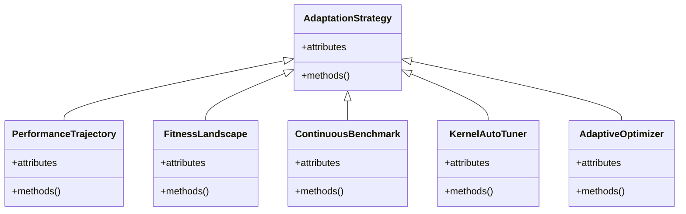

# adaptive_optimization - Class Diagram

```mermaid
classDiagram

    class AdaptationStrategy {
        +methods()
        +attributes
    }

    class PerformanceTrajectory {
        +methods()
        +attributes
    }

    class FitnessLandscape {
        +methods()
        +attributes
    }

    class ContinuousBenchmark {
        +methods()
        +attributes
    }

    class KernelAutoTuner {
        +methods()
        +attributes
    }

    class AdaptiveOptimizer {
        +methods()
        +attributes
    }

    AdaptationStrategy <|-- PerformanceTrajectory
    AdaptationStrategy <|-- FitnessLandscape
    AdaptationStrategy <|-- ContinuousBenchmark
    AdaptationStrategy <|-- KernelAutoTuner
    AdaptationStrategy <|-- AdaptiveOptimizer
```
