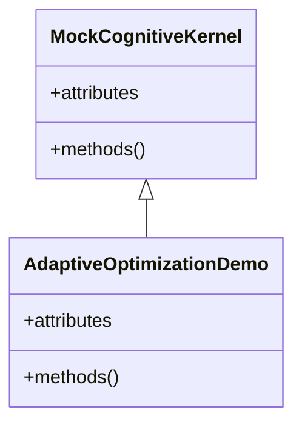

# adaptive_optimization_demo - Class Diagram

```mermaid
classDiagram

    class MockCognitiveKernel {
        +methods()
        +attributes
    }

    class AdaptiveOptimizationDemo {
        +methods()
        +attributes
    }

    MockCognitiveKernel <|-- AdaptiveOptimizationDemo
```
