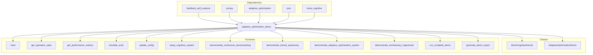

# adaptive_optimization_demo - Architectural Flowchart

```mermaid
graph TD
    M[adaptive_optimization_demo]

    subgraph "Classes"
        C0[MockCognitiveKernel]
        C1[AdaptiveOptimizationDemo]
    end

    M --> C0
    M --> C1
    subgraph "Functions"
        F0[main]
        F2[get_operation_stats]
        F3[get_performance_metrics]
        F4[simulate_work]
        F5[update_config]
        F7[setup_cognitive_system]
        F8[demonstrate_continuous_benchmarking]
        F9[demonstrate_kernel_autotuning]
        F10[demonstrate_adaptive_optimization_system]
        F11[demonstrate_evolutionary_trajectories]
        F12[run_complete_demo]
        F13[generate_demo_report]
    end

    M --> F0
    M --> F2
    M --> F3
    M --> F4
    M --> F5
    M --> F7
    M --> F8
    M --> F9
    M --> F10
    M --> F11
    M --> F12
    M --> F13
    subgraph "Dependencies"
        D0[feedback_self_analysis]
        D1[numpy]
        D2[adaptive_optimization]
        D3[json]
        D4[meta_cognitive]
    end

    D0 --> M
    D1 --> M
    D2 --> M
    D3 --> M
    D4 --> M
```
