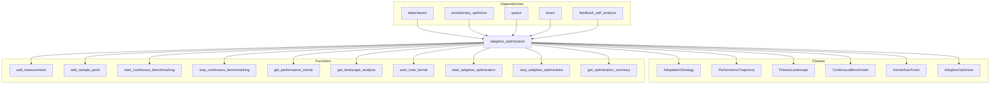

# adaptive_optimization - Architectural Flowchart

```mermaid
graph TD
    M[adaptive_optimization]

    subgraph "Classes"
        C0[AdaptationStrategy]
        C1[PerformanceTrajectory]
        C2[FitnessLandscape]
        C3[ContinuousBenchmark]
        C4[KernelAutoTuner]
        C5[AdaptiveOptimizer]
    end

    M --> C0
    M --> C1
    M --> C2
    M --> C3
    M --> C4
    M --> C5
    subgraph "Functions"
        F0[add_measurement]
        F2[add_sample_point]
        F5[start_continuous_benchmarking]
        F6[stop_continuous_benchmarking]
        F8[get_performance_trends]
        F9[get_landscape_analysis]
        F11[auto_tune_kernel]
        F17[start_adaptive_optimization]
        F18[stop_adaptive_optimization]
        F26[get_optimization_summary]
    end

    M --> F0
    M --> F2
    M --> F5
    M --> F6
    M --> F8
    M --> F9
    M --> F11
    M --> F17
    M --> F18
    M --> F26
    subgraph "Dependencies"
        D0[dataclasses]
        D1[evolutionary_optimizer]
        D2[queue]
        D3[enum]
        D4[feedback_self_analysis]
    end

    D0 --> M
    D1 --> M
    D2 --> M
    D3 --> M
    D4 --> M
```
