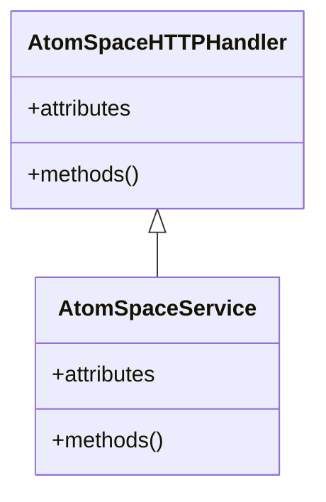

# atomspace_service - Class Diagram

```mermaid
classDiagram

    class AtomSpaceHTTPHandler {
        +methods()
        +attributes
    }

    class AtomSpaceService {
        +methods()
        +attributes
    }

    AtomSpaceHTTPHandler <|-- AtomSpaceService
```
