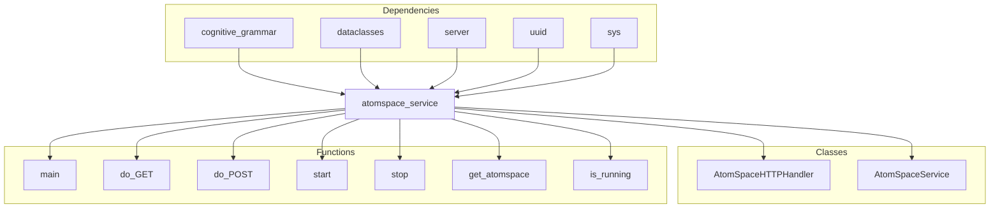

# atomspace_service - Architectural Flowchart

```mermaid
graph TD
    M[atomspace_service]

    subgraph "Classes"
        C0[AtomSpaceHTTPHandler]
        C1[AtomSpaceService]
    end

    M --> C0
    M --> C1
    subgraph "Functions"
        F0[main]
        F1[do_GET]
        F2[do_POST]
        F17[start]
        F18[stop]
        F19[get_atomspace]
        F20[is_running]
    end

    M --> F0
    M --> F1
    M --> F2
    M --> F17
    M --> F18
    M --> F19
    M --> F20
    subgraph "Dependencies"
        D0[cognitive_grammar]
        D1[dataclasses]
        D2[server]
        D3[uuid]
        D4[sys]
    end

    D0 --> M
    D1 --> M
    D2 --> M
    D3 --> M
    D4 --> M
```
