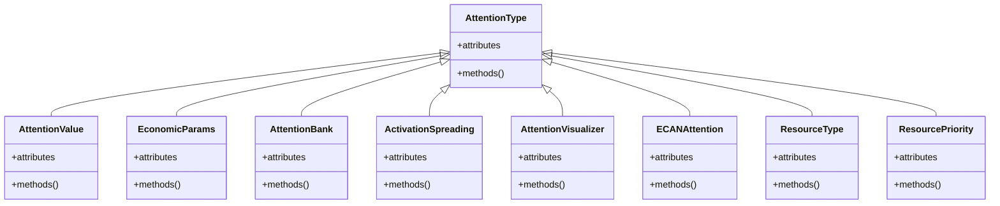

# attention_allocation - Class Diagram

```mermaid
classDiagram

    class AttentionType {
        +methods()
        +attributes
    }

    class AttentionValue {
        +methods()
        +attributes
    }

    class EconomicParams {
        +methods()
        +attributes
    }

    class AttentionBank {
        +methods()
        +attributes
    }

    class ActivationSpreading {
        +methods()
        +attributes
    }

    class AttentionVisualizer {
        +methods()
        +attributes
    }

    class ECANAttention {
        +methods()
        +attributes
    }

    class ResourceType {
        +methods()
        +attributes
    }

    class ResourcePriority {
        +methods()
        +attributes
    }

    AttentionType <|-- AttentionValue
    AttentionType <|-- EconomicParams
    AttentionType <|-- AttentionBank
    AttentionType <|-- ActivationSpreading
    AttentionType <|-- AttentionVisualizer
    AttentionType <|-- ECANAttention
    AttentionType <|-- ResourceType
    AttentionType <|-- ResourcePriority
```
