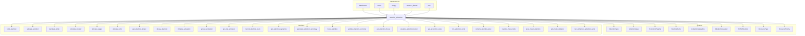

# attention_allocation - Architectural Flowchart

```mermaid
graph TD
    M[attention_allocation]

    subgraph "Classes"
        C0[AttentionType]
        C1[AttentionValue]
        C2[EconomicParams]
        C3[AttentionBank]
        C4[ActivationSpreading]
        C5[AttentionVisualizer]
        C6[ECANAttention]
        C7[ResourceType]
        C8[ResourcePriority]
    end

    M --> C0
    M --> C1
    M --> C2
    M --> C3
    M --> C4
    M --> C5
    M --> C6
    M --> C7
    M --> C8
    subgraph "Functions"
        F0[total_attention]
        F2[allocate_attention]
        F3[calculate_utility]
        F4[calculate_novelty]
        F5[allocate_wages]
        F6[allocate_rents]
        F7[get_attention_tensor]
        F8[decay_attention]
        F10[initialize_activation]
        F11[spread_activation]
        F12[get_top_activated]
        F14[record_attention_state]
        F15[get_attention_dynamics]
        F16[generate_attention_summary]
        F18[focus_attention]
        F19[update_attention_economy]
        F20[get_attention_focus]
        F21[visualize_attention_tensor]
        F22[get_economic_stats]
        F23[run_attention_cycle]
        F24[scheme_attention_spec]
        F25[register_mesh_node]
        F27[sync_mesh_attention]
        F28[get_mesh_statistics]
        F29[run_enhanced_attention_cycle]
    end

    M --> F0
    M --> F2
    M --> F3
    M --> F4
    M --> F5
    M --> F6
    M --> F7
    M --> F8
    M --> F10
    M --> F11
    M --> F12
    M --> F14
    M --> F15
    M --> F16
    M --> F18
    M --> F19
    M --> F20
    M --> F21
    M --> F22
    M --> F23
    M --> F24
    M --> F25
    M --> F27
    M --> F28
    M --> F29
    subgraph "Dependencies"
        D0[dataclasses]
        D1[enum]
        D2[numpy]
        D3[resource_kernel]
        D4[json]
    end

    D0 --> M
    D1 --> M
    D2 --> M
    D3 --> M
    D4 --> M
```
