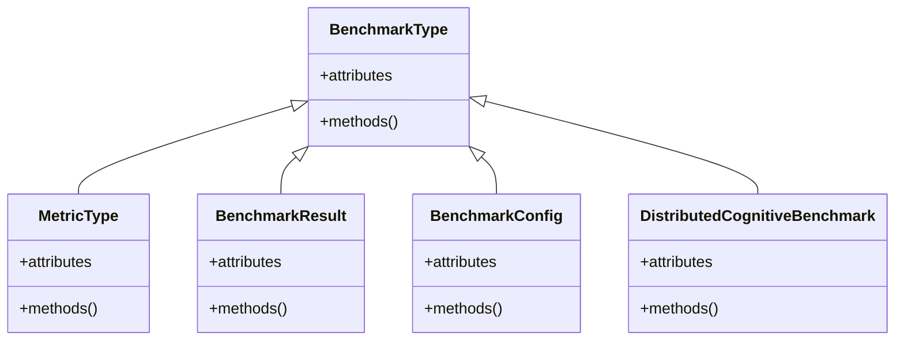

# benchmarking - Class Diagram

```mermaid
classDiagram

    class BenchmarkType {
        +methods()
        +attributes
    }

    class MetricType {
        +methods()
        +attributes
    }

    class BenchmarkResult {
        +methods()
        +attributes
    }

    class BenchmarkConfig {
        +methods()
        +attributes
    }

    class DistributedCognitiveBenchmark {
        +methods()
        +attributes
    }

    BenchmarkType <|-- MetricType
    BenchmarkType <|-- BenchmarkResult
    BenchmarkType <|-- BenchmarkConfig
    BenchmarkType <|-- DistributedCognitiveBenchmark
```
