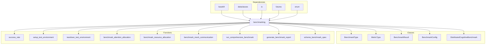

# benchmarking - Architectural Flowchart

```mermaid
graph TD
    M[benchmarking]

    subgraph "Classes"
        C0[BenchmarkType]
        C1[MetricType]
        C2[BenchmarkResult]
        C3[BenchmarkConfig]
        C4[DistributedCognitiveBenchmark]
    end

    M --> C0
    M --> C1
    M --> C2
    M --> C3
    M --> C4
    subgraph "Functions"
        F1[success_rate]
        F4[setup_test_environment]
        F5[teardown_test_environment]
        F6[benchmark_attention_allocation]
        F8[benchmark_resource_allocation]
        F10[benchmark_mesh_communication]
        F12[run_comprehensive_benchmark]
        F16[generate_benchmark_report]
        F17[scheme_benchmark_spec]
    end

    M --> F1
    M --> F4
    M --> F5
    M --> F6
    M --> F8
    M --> F10
    M --> F12
    M --> F16
    M --> F17
    subgraph "Dependencies"
        D0[base64]
        D1[dataclasses]
        D2[io]
        D3[futures]
        D4[enum]
    end

    D0 --> M
    D1 --> M
    D2 --> M
    D3 --> M
    D4 --> M
```
