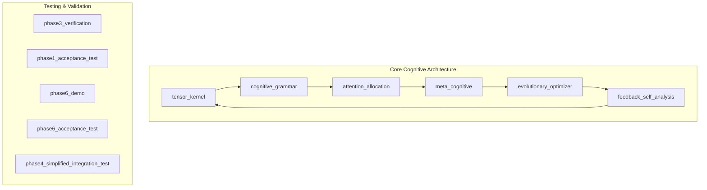

# Cognitive Architecture - Dependency Graph

```mermaid
graph TB

    subgraph "Core Cognitive Architecture"
        TENSOR_KERNEL[tensor_kernel]
        COGNITIVE_GRAMMAR[cognitive_grammar]
        ATTENTION_ALLOCATION[attention_allocation]
        META_COGNITIVE[meta_cognitive]
        EVOLUTIONARY_OPTIMIZER[evolutionary_optimizer]
        FEEDBACK_SELF_ANALYSIS[feedback_self_analysis]
    end

    subgraph "Testing & Validation"
        PHASE3_VERIFICATION[phase3_verification]
        PHASE1_ACCEPTANCE_TEST[phase1_acceptance_test]
        PHASE6_DEMO[phase6_demo]
        PHASE6_ACCEPTANCE_TEST[phase6_acceptance_test]
        PHASE4_SIMPLIFIED_INTEGRATION_TEST[phase4_simplified_integration_test]
    end

    TENSOR_KERNEL --> COGNITIVE_GRAMMAR
    COGNITIVE_GRAMMAR --> ATTENTION_ALLOCATION
    ATTENTION_ALLOCATION --> META_COGNITIVE
    META_COGNITIVE --> EVOLUTIONARY_OPTIMIZER
    EVOLUTIONARY_OPTIMIZER --> FEEDBACK_SELF_ANALYSIS
    FEEDBACK_SELF_ANALYSIS --> TENSOR_KERNEL
```
