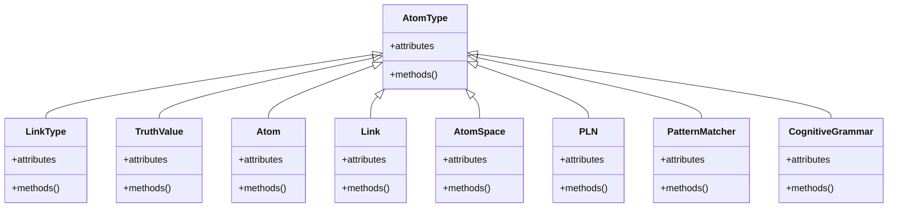

# cognitive_grammar - Class Diagram

```mermaid
classDiagram

    class AtomType {
        +methods()
        +attributes
    }

    class LinkType {
        +methods()
        +attributes
    }

    class TruthValue {
        +methods()
        +attributes
    }

    class Atom {
        +methods()
        +attributes
    }

    class Link {
        +methods()
        +attributes
    }

    class AtomSpace {
        +methods()
        +attributes
    }

    class PLN {
        +methods()
        +attributes
    }

    class PatternMatcher {
        +methods()
        +attributes
    }

    class CognitiveGrammar {
        +methods()
        +attributes
    }

    AtomType <|-- LinkType
    AtomType <|-- TruthValue
    AtomType <|-- Atom
    AtomType <|-- Link
    AtomType <|-- AtomSpace
    AtomType <|-- PLN
    AtomType <|-- PatternMatcher
    AtomType <|-- CognitiveGrammar
```
