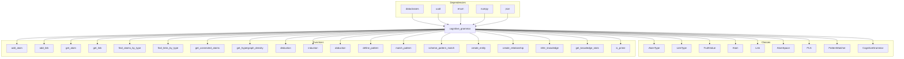

# cognitive_grammar - Architectural Flowchart

```mermaid
graph TD
    M[cognitive_grammar]

    subgraph "Classes"
        C0[AtomType]
        C1[LinkType]
        C2[TruthValue]
        C3[Atom]
        C4[Link]
        C5[AtomSpace]
        C6[PLN]
        C7[PatternMatcher]
        C8[CognitiveGrammar]
    end

    M --> C0
    M --> C1
    M --> C2
    M --> C3
    M --> C4
    M --> C5
    M --> C6
    M --> C7
    M --> C8
    subgraph "Functions"
        F4[add_atom]
        F5[add_link]
        F6[get_atom]
        F7[get_link]
        F8[find_atoms_by_type]
        F9[find_links_by_type]
        F10[get_connected_atoms]
        F12[get_hypergraph_density]
        F14[deduction]
        F15[induction]
        F16[abduction]
        F18[define_pattern]
        F19[match_pattern]
        F21[scheme_pattern_match]
        F24[create_entity]
        F25[create_relationship]
        F26[infer_knowledge]
        F27[get_knowledge_stats]
        F28[is_prime]
    end

    M --> F4
    M --> F5
    M --> F6
    M --> F7
    M --> F8
    M --> F9
    M --> F10
    M --> F12
    M --> F14
    M --> F15
    M --> F16
    M --> F18
    M --> F19
    M --> F21
    M --> F24
    M --> F25
    M --> F26
    M --> F27
    M --> F28
    subgraph "Dependencies"
        D0[dataclasses]
        D1[uuid]
        D2[enum]
        D3[numpy]
        D4[json]
    end

    D0 --> M
    D1 --> M
    D2 --> M
    D3 --> M
    D4 --> M
```
