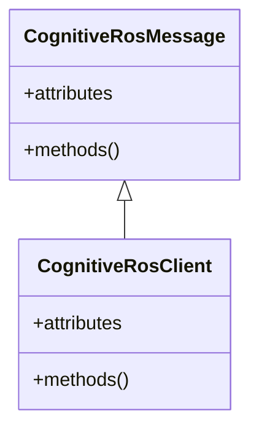

# cognitive_ros_client - Class Diagram

```mermaid
classDiagram

    class CognitiveRosMessage {
        +methods()
        +attributes
    }

    class CognitiveRosClient {
        +methods()
        +attributes
    }

    CognitiveRosMessage <|-- CognitiveRosClient
```
