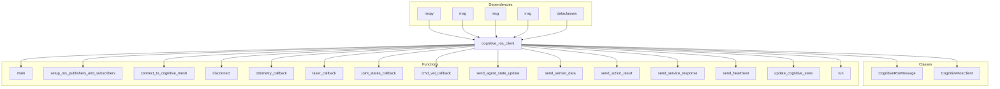

# cognitive_ros_client - Architectural Flowchart

```mermaid
graph TD
    M[cognitive_ros_client]

    subgraph "Classes"
        C0[CognitiveRosMessage]
        C1[CognitiveRosClient]
    end

    M --> C0
    M --> C1
    subgraph "Functions"
        F0[main]
        F3[setup_ros_publishers_and_subscribers]
        F4[connect_to_cognitive_mesh]
        F5[disconnect]
        F21[odometry_callback]
        F22[laser_callback]
        F23[joint_states_callback]
        F24[cmd_vel_callback]
        F25[send_agent_state_update]
        F26[send_sensor_data]
        F27[send_action_result]
        F28[send_service_response]
        F29[send_heartbeat]
        F30[update_cognitive_state]
        F31[run]
    end

    M --> F0
    M --> F3
    M --> F4
    M --> F5
    M --> F21
    M --> F22
    M --> F23
    M --> F24
    M --> F25
    M --> F26
    M --> F27
    M --> F28
    M --> F29
    M --> F30
    M --> F31
    subgraph "Dependencies"
        D0[rospy]
        D1[msg]
        D2[msg]
        D3[msg]
        D4[dataclasses]
    end

    D0 --> M
    D1 --> M
    D2 --> M
    D3 --> M
    D4 --> M
```
