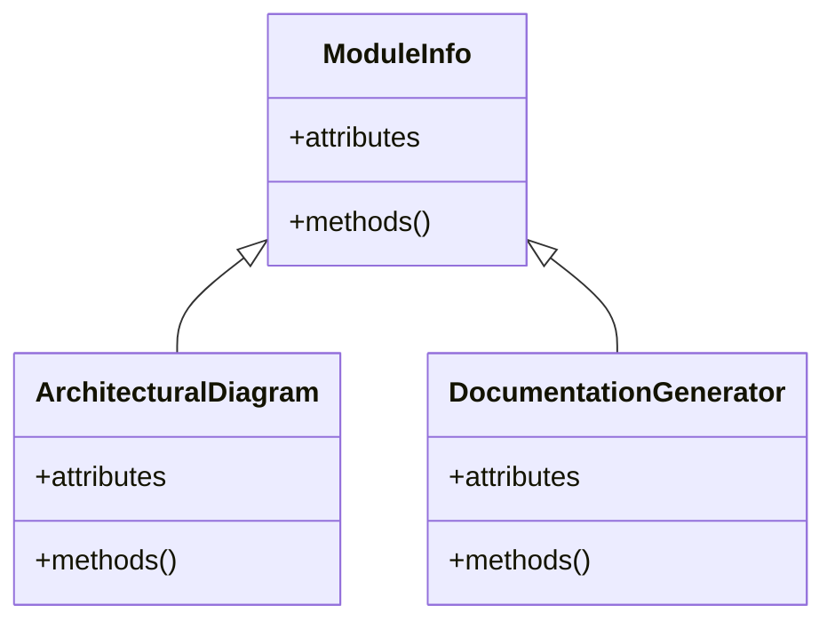

# documentation_generator - Class Diagram

```mermaid
classDiagram

    class ModuleInfo {
        +methods()
        +attributes
    }

    class ArchitecturalDiagram {
        +methods()
        +attributes
    }

    class DocumentationGenerator {
        +methods()
        +attributes
    }

    ModuleInfo <|-- ArchitecturalDiagram
    ModuleInfo <|-- DocumentationGenerator
```
