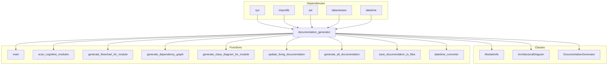

# documentation_generator - Architectural Flowchart

```mermaid
graph TD
    M[documentation_generator]

    subgraph "Classes"
        C0[ModuleInfo]
        C1[ArchitecturalDiagram]
        C2[DocumentationGenerator]
    end

    M --> C0
    M --> C1
    M --> C2
    subgraph "Functions"
        F0[main]
        F2[scan_cognitive_modules]
        F5[generate_flowchart_for_module]
        F7[generate_dependency_graph]
        F9[generate_class_diagram_for_module]
        F11[update_living_documentation]
        F15[generate_all_documentation]
        F18[save_documentation_to_files]
        F19[datetime_converter]
    end

    M --> F0
    M --> F2
    M --> F5
    M --> F7
    M --> F9
    M --> F11
    M --> F15
    M --> F18
    M --> F19
    subgraph "Dependencies"
        D0[sys]
        D1[importlib]
        D2[ast]
        D3[dataclasses]
        D4[datetime]
    end

    D0 --> M
    D1 --> M
    D2 --> M
    D3 --> M
    D4 --> M
```
