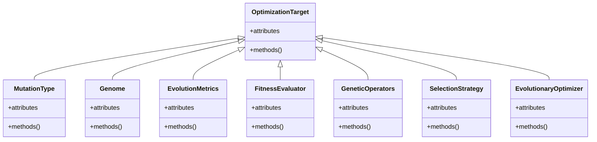

# evolutionary_optimizer - Class Diagram

```mermaid
classDiagram

    class OptimizationTarget {
        +methods()
        +attributes
    }

    class MutationType {
        +methods()
        +attributes
    }

    class Genome {
        +methods()
        +attributes
    }

    class EvolutionMetrics {
        +methods()
        +attributes
    }

    class FitnessEvaluator {
        +methods()
        +attributes
    }

    class GeneticOperators {
        +methods()
        +attributes
    }

    class SelectionStrategy {
        +methods()
        +attributes
    }

    class EvolutionaryOptimizer {
        +methods()
        +attributes
    }

    OptimizationTarget <|-- MutationType
    OptimizationTarget <|-- Genome
    OptimizationTarget <|-- EvolutionMetrics
    OptimizationTarget <|-- FitnessEvaluator
    OptimizationTarget <|-- GeneticOperators
    OptimizationTarget <|-- SelectionStrategy
    OptimizationTarget <|-- EvolutionaryOptimizer
```
