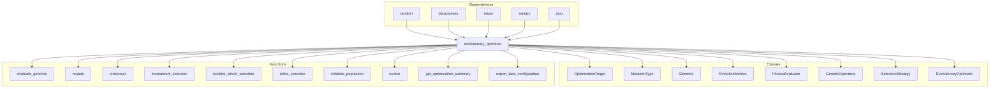

# evolutionary_optimizer - Architectural Flowchart

```mermaid
graph TD
    M[evolutionary_optimizer]

    subgraph "Classes"
        C0[OptimizationTarget]
        C1[MutationType]
        C2[Genome]
        C3[EvolutionMetrics]
        C4[FitnessEvaluator]
        C5[GeneticOperators]
        C6[SelectionStrategy]
        C7[EvolutionaryOptimizer]
    end

    M --> C0
    M --> C1
    M --> C2
    M --> C3
    M --> C4
    M --> C5
    M --> C6
    M --> C7
    subgraph "Functions"
        F2[evaluate_genome]
        F15[mutate]
        F20[crossover]
        F21[tournament_selection]
        F22[roulette_wheel_selection]
        F23[elitist_selection]
        F25[initialize_population]
        F27[evolve]
        F31[get_optimization_summary]
        F32[export_best_configuration]
    end

    M --> F2
    M --> F15
    M --> F20
    M --> F21
    M --> F22
    M --> F23
    M --> F25
    M --> F27
    M --> F31
    M --> F32
    subgraph "Dependencies"
        D0[random]
        D1[dataclasses]
        D2[enum]
        D3[numpy]
        D4[json]
    end

    D0 --> M
    D1 --> M
    D2 --> M
    D3 --> M
    D4 --> M
```
