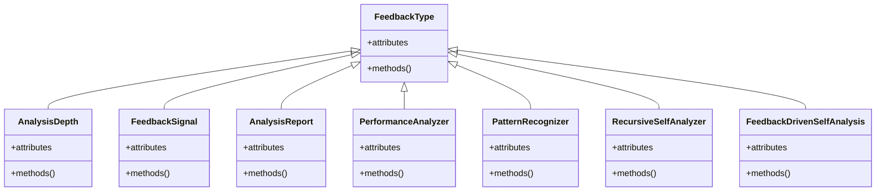

# feedback_self_analysis - Class Diagram

```mermaid
classDiagram

    class FeedbackType {
        +methods()
        +attributes
    }

    class AnalysisDepth {
        +methods()
        +attributes
    }

    class FeedbackSignal {
        +methods()
        +attributes
    }

    class AnalysisReport {
        +methods()
        +attributes
    }

    class PerformanceAnalyzer {
        +methods()
        +attributes
    }

    class PatternRecognizer {
        +methods()
        +attributes
    }

    class RecursiveSelfAnalyzer {
        +methods()
        +attributes
    }

    class FeedbackDrivenSelfAnalysis {
        +methods()
        +attributes
    }

    FeedbackType <|-- AnalysisDepth
    FeedbackType <|-- FeedbackSignal
    FeedbackType <|-- AnalysisReport
    FeedbackType <|-- PerformanceAnalyzer
    FeedbackType <|-- PatternRecognizer
    FeedbackType <|-- RecursiveSelfAnalyzer
    FeedbackType <|-- FeedbackDrivenSelfAnalysis
```
