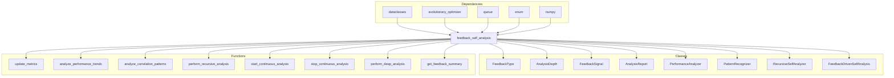

# feedback_self_analysis - Architectural Flowchart

```mermaid
graph TD
    M[feedback_self_analysis]

    subgraph "Classes"
        C0[FeedbackType]
        C1[AnalysisDepth]
        C2[FeedbackSignal]
        C3[AnalysisReport]
        C4[PerformanceAnalyzer]
        C5[PatternRecognizer]
        C6[RecursiveSelfAnalyzer]
        C7[FeedbackDrivenSelfAnalysis]
    end

    M --> C0
    M --> C1
    M --> C2
    M --> C3
    M --> C4
    M --> C5
    M --> C6
    M --> C7
    subgraph "Functions"
        F3[update_metrics]
        F4[analyze_performance_trends]
        F10[analyze_correlation_patterns]
        F14[perform_recursive_analysis]
        F27[start_continuous_analysis]
        F28[stop_continuous_analysis]
        F35[perform_deep_analysis]
        F36[get_feedback_summary]
    end

    M --> F3
    M --> F4
    M --> F10
    M --> F14
    M --> F27
    M --> F28
    M --> F35
    M --> F36
    subgraph "Dependencies"
        D0[dataclasses]
        D1[evolutionary_optimizer]
        D2[queue]
        D3[enum]
        D4[numpy]
    end

    D0 --> M
    D1 --> M
    D2 --> M
    D3 --> M
    D4 --> M
```
