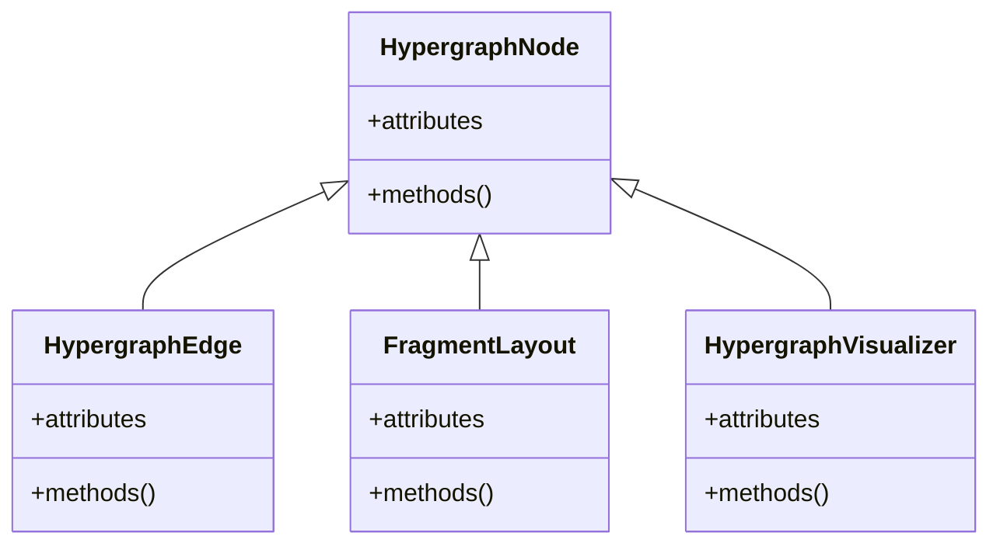

# hypergraph_visualizer - Class Diagram

```mermaid
classDiagram

    class HypergraphNode {
        +methods()
        +attributes
    }

    class HypergraphEdge {
        +methods()
        +attributes
    }

    class FragmentLayout {
        +methods()
        +attributes
    }

    class HypergraphVisualizer {
        +methods()
        +attributes
    }

    HypergraphNode <|-- HypergraphEdge
    HypergraphNode <|-- FragmentLayout
    HypergraphNode <|-- HypergraphVisualizer
```
