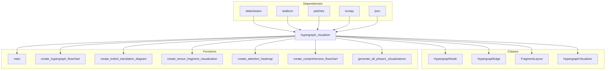

# hypergraph_visualizer - Architectural Flowchart

```mermaid
graph TD
    M[hypergraph_visualizer]

    subgraph "Classes"
        C0[HypergraphNode]
        C1[HypergraphEdge]
        C2[FragmentLayout]
        C3[HypergraphVisualizer]
    end

    M --> C0
    M --> C1
    M --> C2
    M --> C3
    subgraph "Functions"
        F0[main]
        F2[create_hypergraph_flowchart]
        F3[create_ko6ml_translation_diagram]
        F4[create_tensor_fragment_visualization]
        F5[create_attention_heatmap]
        F6[create_comprehensive_flowchart]
        F20[generate_all_phase1_visualizations]
    end

    M --> F0
    M --> F2
    M --> F3
    M --> F4
    M --> F5
    M --> F6
    M --> F20
    subgraph "Dependencies"
        D0[dataclasses]
        D1[seaborn]
        D2[patches]
        D3[numpy]
        D4[json]
    end

    D0 --> M
    D1 --> M
    D2 --> M
    D3 --> M
    D4 --> M
```
