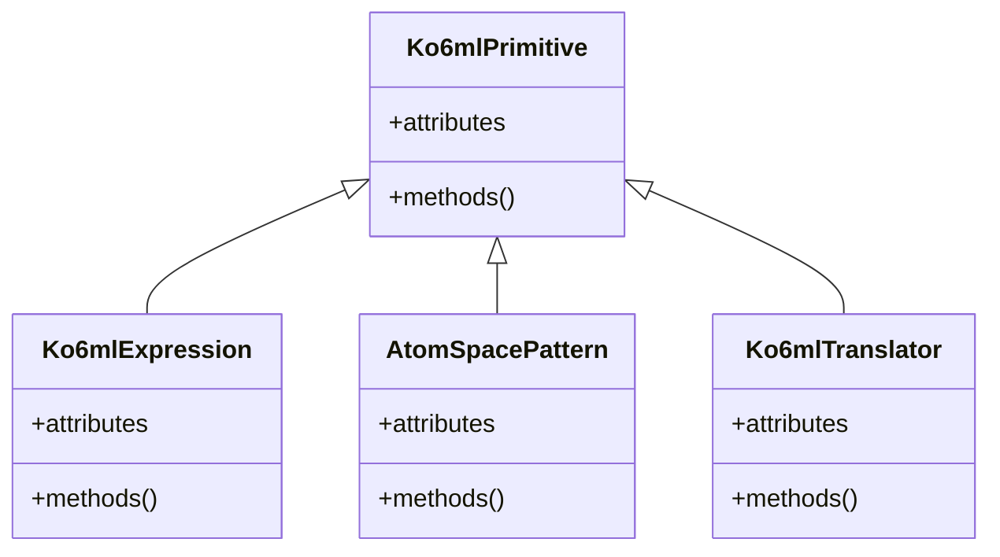

# ko6ml_translator - Class Diagram

```mermaid
classDiagram

    class Ko6mlPrimitive {
        +methods()
        +attributes
    }

    class Ko6mlExpression {
        +methods()
        +attributes
    }

    class AtomSpacePattern {
        +methods()
        +attributes
    }

    class Ko6mlTranslator {
        +methods()
        +attributes
    }

    Ko6mlPrimitive <|-- Ko6mlExpression
    Ko6mlPrimitive <|-- AtomSpacePattern
    Ko6mlPrimitive <|-- Ko6mlTranslator
```
