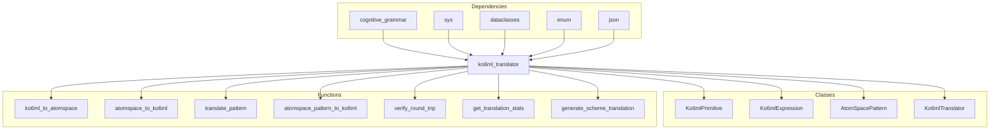

# ko6ml_translator - Architectural Flowchart

```mermaid
graph TD
    M[ko6ml_translator]

    subgraph "Classes"
        C0[Ko6mlPrimitive]
        C1[Ko6mlExpression]
        C2[AtomSpacePattern]
        C3[Ko6mlTranslator]
    end

    M --> C0
    M --> C1
    M --> C2
    M --> C3
    subgraph "Functions"
        F2[ko6ml_to_atomspace]
        F3[atomspace_to_ko6ml]
        F4[translate_pattern]
        F5[atomspace_pattern_to_ko6ml]
        F6[verify_round_trip]
        F12[get_translation_stats]
        F13[generate_scheme_translation]
    end

    M --> F2
    M --> F3
    M --> F4
    M --> F5
    M --> F6
    M --> F12
    M --> F13
    subgraph "Dependencies"
        D0[cognitive_grammar]
        D1[sys]
        D2[dataclasses]
        D3[enum]
        D4[json]
    end

    D0 --> M
    D1 --> M
    D2 --> M
    D3 --> M
    D4 --> M
```
