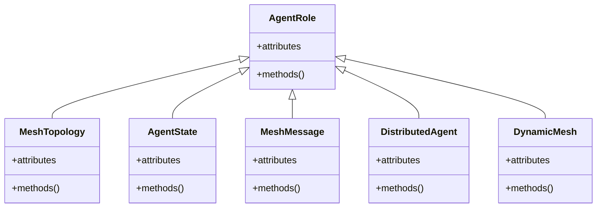

# mesh_topology - Class Diagram

```mermaid
classDiagram

    class AgentRole {
        +methods()
        +attributes
    }

    class MeshTopology {
        +methods()
        +attributes
    }

    class AgentState {
        +methods()
        +attributes
    }

    class MeshMessage {
        +methods()
        +attributes
    }

    class DistributedAgent {
        +methods()
        +attributes
    }

    class DynamicMesh {
        +methods()
        +attributes
    }

    AgentRole <|-- MeshTopology
    AgentRole <|-- AgentState
    AgentRole <|-- MeshMessage
    AgentRole <|-- DistributedAgent
    AgentRole <|-- DynamicMesh
```
