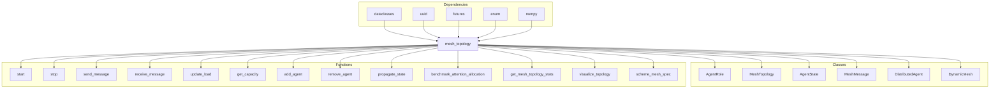

# mesh_topology - Architectural Flowchart

```mermaid
graph TD
    M[mesh_topology]

    subgraph "Classes"
        C0[AgentRole]
        C1[MeshTopology]
        C2[AgentState]
        C3[MeshMessage]
        C4[DistributedAgent]
        C5[DynamicMesh]
    end

    M --> C0
    M --> C1
    M --> C2
    M --> C3
    M --> C4
    M --> C5
    subgraph "Functions"
        F5[start]
        F6[stop]
        F7[send_message]
        F8[receive_message]
        F9[update_load]
        F10[get_capacity]
        F23[add_agent]
        F24[remove_agent]
        F28[propagate_state]
        F29[benchmark_attention_allocation]
        F30[get_mesh_topology_stats]
        F31[visualize_topology]
        F32[scheme_mesh_spec]
    end

    M --> F5
    M --> F6
    M --> F7
    M --> F8
    M --> F9
    M --> F10
    M --> F23
    M --> F24
    M --> F28
    M --> F29
    M --> F30
    M --> F31
    M --> F32
    subgraph "Dependencies"
        D0[dataclasses]
        D1[uuid]
        D2[futures]
        D3[enum]
        D4[numpy]
    end

    D0 --> M
    D1 --> M
    D2 --> M
    D3 --> M
    D4 --> M
```
