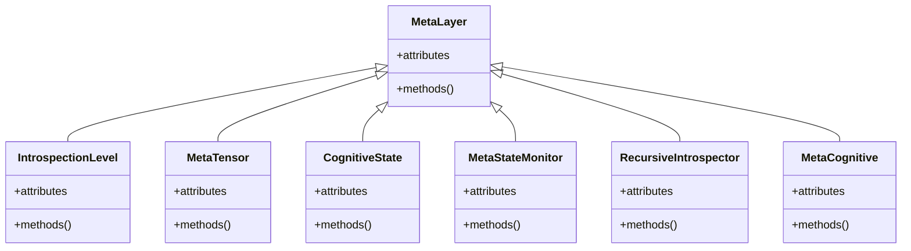

# meta_cognitive - Class Diagram

```mermaid
classDiagram

    class MetaLayer {
        +methods()
        +attributes
    }

    class IntrospectionLevel {
        +methods()
        +attributes
    }

    class MetaTensor {
        +methods()
        +attributes
    }

    class CognitiveState {
        +methods()
        +attributes
    }

    class MetaStateMonitor {
        +methods()
        +attributes
    }

    class RecursiveIntrospector {
        +methods()
        +attributes
    }

    class MetaCognitive {
        +methods()
        +attributes
    }

    MetaLayer <|-- IntrospectionLevel
    MetaLayer <|-- MetaTensor
    MetaLayer <|-- CognitiveState
    MetaLayer <|-- MetaStateMonitor
    MetaLayer <|-- RecursiveIntrospector
    MetaLayer <|-- MetaCognitive
```
