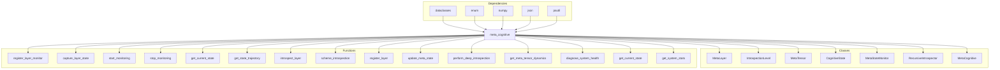

# meta_cognitive - Architectural Flowchart

```mermaid
graph TD
    M[meta_cognitive]

    subgraph "Classes"
        C0[MetaLayer]
        C1[IntrospectionLevel]
        C2[MetaTensor]
        C3[CognitiveState]
        C4[MetaStateMonitor]
        C5[RecursiveIntrospector]
        C6[MetaCognitive]
    end

    M --> C0
    M --> C1
    M --> C2
    M --> C3
    M --> C4
    M --> C5
    M --> C6
    subgraph "Functions"
        F2[register_layer_monitor]
        F3[capture_layer_state]
        F10[start_monitoring]
        F11[stop_monitoring]
        F12[get_current_state]
        F13[get_state_trajectory]
        F15[introspect_layer]
        F20[scheme_introspection]
        F22[register_layer]
        F23[update_meta_state]
        F26[perform_deep_introspection]
        F27[get_meta_tensor_dynamics]
        F28[diagnose_system_health]
        F30[get_current_state]
        F31[get_system_stats]
    end

    M --> F2
    M --> F3
    M --> F10
    M --> F11
    M --> F12
    M --> F13
    M --> F15
    M --> F20
    M --> F22
    M --> F23
    M --> F26
    M --> F27
    M --> F28
    M --> F30
    M --> F31
    subgraph "Dependencies"
        D0[dataclasses]
        D1[enum]
        D2[numpy]
        D3[json]
        D4[psutil]
    end

    D0 --> M
    D1 --> M
    D2 --> M
    D3 --> M
    D4 --> M
```
