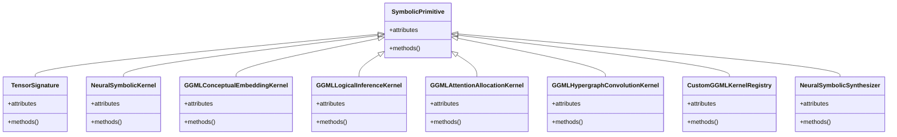

# neural_symbolic_kernels - Class Diagram

```mermaid
classDiagram

    class SymbolicPrimitive {
        +methods()
        +attributes
    }

    class TensorSignature {
        +methods()
        +attributes
    }

    class NeuralSymbolicKernel {
        +methods()
        +attributes
    }

    class GGMLConceptualEmbeddingKernel {
        +methods()
        +attributes
    }

    class GGMLLogicalInferenceKernel {
        +methods()
        +attributes
    }

    class GGMLAttentionAllocationKernel {
        +methods()
        +attributes
    }

    class GGMLHypergraphConvolutionKernel {
        +methods()
        +attributes
    }

    class CustomGGMLKernelRegistry {
        +methods()
        +attributes
    }

    class NeuralSymbolicSynthesizer {
        +methods()
        +attributes
    }

    SymbolicPrimitive <|-- TensorSignature
    SymbolicPrimitive <|-- NeuralSymbolicKernel
    SymbolicPrimitive <|-- GGMLConceptualEmbeddingKernel
    SymbolicPrimitive <|-- GGMLLogicalInferenceKernel
    SymbolicPrimitive <|-- GGMLAttentionAllocationKernel
    SymbolicPrimitive <|-- GGMLHypergraphConvolutionKernel
    SymbolicPrimitive <|-- CustomGGMLKernelRegistry
    SymbolicPrimitive <|-- NeuralSymbolicSynthesizer
```
