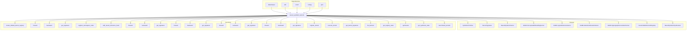

# neural_symbolic_kernels - Architectural Flowchart

```mermaid
graph TD
    M[neural_symbolic_kernels]

    subgraph "Classes"
        C0[SymbolicPrimitive]
        C1[TensorSignature]
        C2[NeuralSymbolicKernel]
        C3[GGMLConceptualEmbeddingKernel]
        C4[GGMLLogicalInferenceKernel]
        C5[GGMLAttentionAllocationKernel]
        C6[GGMLHypergraphConvolutionKernel]
        C7[CustomGGMLKernelRegistry]
        C8[NeuralSymbolicSynthesizer]
    end

    M --> C0
    M --> C1
    M --> C2
    M --> C3
    M --> C4
    M --> C5
    M --> C6
    M --> C7
    M --> C8
    subgraph "Functions"
        F0[create_default_kernel_registry]
        F1[forward]
        F2[backward]
        F3[get_signature]
        F6[register_atomspace_node]
        F7[add_neural_inference_hook]
        F8[forward]
        F11[backward]
        F13[get_signature]
        F15[forward]
        F20[backward]
        F21[get_signature]
        F23[forward]
        F25[backward]
        F26[get_signature]
        F28[forward]
        F30[backward]
        F31[get_signature]
        F33[register_kernel]
        F34[execute_kernel]
        F35[get_kernel_signature]
        F36[list_kernels]
        F37[get_registry_stats]
        F39[synthesize]
        F41[get_synthesis_stats]
        F42[benchmark_kernels]
    end

    M --> F0
    M --> F1
    M --> F2
    M --> F3
    M --> F6
    M --> F7
    M --> F8
    M --> F11
    M --> F13
    M --> F15
    M --> F20
    M --> F21
    M --> F23
    M --> F25
    M --> F26
    M --> F28
    M --> F30
    M --> F31
    M --> F33
    M --> F34
    M --> F35
    M --> F36
    M --> F37
    M --> F39
    M --> F41
    M --> F42
    subgraph "Dependencies"
        D0[dataclasses]
        D1[abc]
        D2[enum]
        D3[numpy]
        D4[json]
    end

    D0 --> M
    D1 --> M
    D2 --> M
    D3 --> M
    D4 --> M
```
