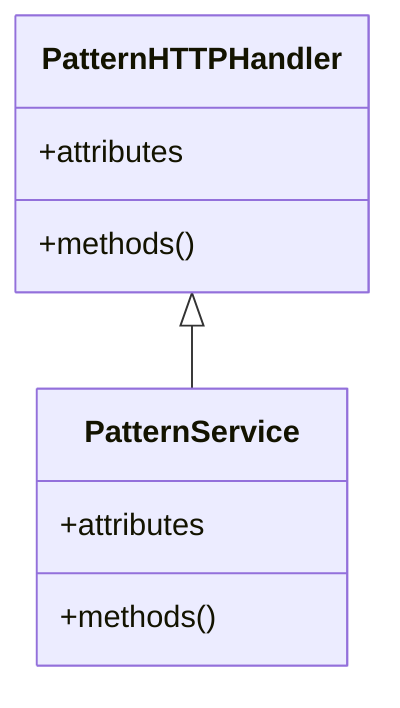

# pattern_service - Class Diagram

```mermaid
classDiagram

    class PatternHTTPHandler {
        +methods()
        +attributes
    }

    class PatternService {
        +methods()
        +attributes
    }

    PatternHTTPHandler <|-- PatternService
```
