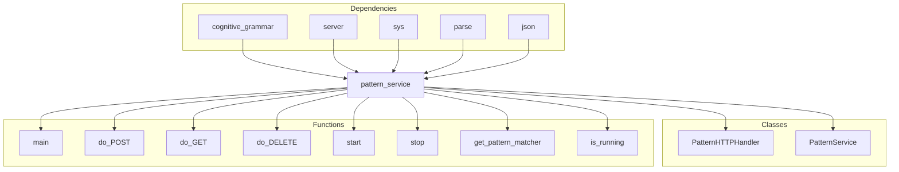

# pattern_service - Architectural Flowchart

```mermaid
graph TD
    M[pattern_service]

    subgraph "Classes"
        C0[PatternHTTPHandler]
        C1[PatternService]
    end

    M --> C0
    M --> C1
    subgraph "Functions"
        F0[main]
        F1[do_POST]
        F2[do_GET]
        F3[do_DELETE]
        F16[start]
        F17[stop]
        F18[get_pattern_matcher]
        F19[is_running]
    end

    M --> F0
    M --> F1
    M --> F2
    M --> F3
    M --> F16
    M --> F17
    M --> F18
    M --> F19
    subgraph "Dependencies"
        D0[cognitive_grammar]
        D1[server]
        D2[sys]
        D3[parse]
        D4[json]
    end

    D0 --> M
    D1 --> M
    D2 --> M
    D3 --> M
    D4 --> M
```
