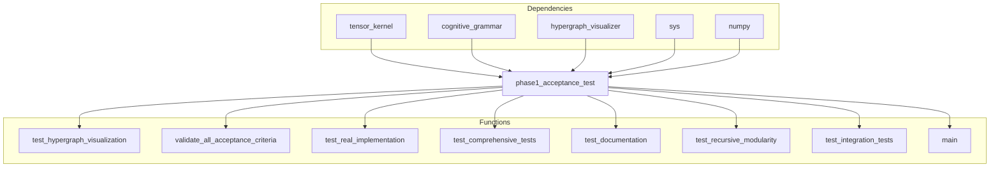

# phase1_acceptance_test - Architectural Flowchart

```mermaid
graph TD
    M[phase1_acceptance_test]

    subgraph "Functions"
        F0[test_hypergraph_visualization]
        F1[validate_all_acceptance_criteria]
        F2[test_real_implementation]
        F3[test_comprehensive_tests]
        F4[test_documentation]
        F5[test_recursive_modularity]
        F6[test_integration_tests]
        F7[main]
    end

    M --> F0
    M --> F1
    M --> F2
    M --> F3
    M --> F4
    M --> F5
    M --> F6
    M --> F7
    subgraph "Dependencies"
        D0[tensor_kernel]
        D1[cognitive_grammar]
        D2[hypergraph_visualizer]
        D3[sys]
        D4[numpy]
    end

    D0 --> M
    D1 --> M
    D2 --> M
    D3 --> M
    D4 --> M
```
