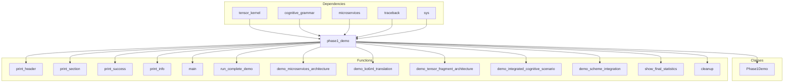

# phase1_demo - Architectural Flowchart

```mermaid
graph TD
    M[phase1_demo]

    subgraph "Classes"
        C0[Phase1Demo]
    end

    M --> C0
    subgraph "Functions"
        F0[print_header]
        F1[print_section]
        F2[print_success]
        F3[print_info]
        F4[main]
        F6[run_complete_demo]
        F7[demo_microservices_architecture]
        F8[demo_ko6ml_translation]
        F9[demo_tensor_fragment_architecture]
        F10[demo_integrated_cognitive_scenario]
        F11[demo_scheme_integration]
        F12[show_final_statistics]
        F13[cleanup]
    end

    M --> F0
    M --> F1
    M --> F2
    M --> F3
    M --> F4
    M --> F6
    M --> F7
    M --> F8
    M --> F9
    M --> F10
    M --> F11
    M --> F12
    M --> F13
    subgraph "Dependencies"
        D0[tensor_kernel]
        D1[cognitive_grammar]
        D2[microservices]
        D3[traceback]
        D4[sys]
    end

    D0 --> M
    D1 --> M
    D2 --> M
    D3 --> M
    D4 --> M
```
