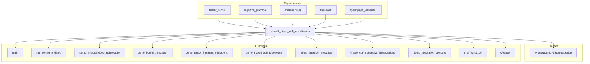

# phase1_demo_with_visualization - Architectural Flowchart

```mermaid
graph TD
    M[phase1_demo_with_visualization]

    subgraph "Classes"
        C0[Phase1DemoWithVisualization]
    end

    M --> C0
    subgraph "Functions"
        F0[main]
        F2[run_complete_demo]
        F3[demo_microservices_architecture]
        F4[demo_ko6ml_translation]
        F5[demo_tensor_fragment_operations]
        F6[demo_hypergraph_knowledge]
        F7[demo_attention_allocation]
        F8[create_comprehensive_visualizations]
        F9[demo_integration_scenario]
        F10[final_validation]
        F11[cleanup]
    end

    M --> F0
    M --> F2
    M --> F3
    M --> F4
    M --> F5
    M --> F6
    M --> F7
    M --> F8
    M --> F9
    M --> F10
    M --> F11
    subgraph "Dependencies"
        D0[tensor_kernel]
        D1[cognitive_grammar]
        D2[microservices]
        D3[traceback]
        D4[hypergraph_visualizer]
    end

    D0 --> M
    D1 --> M
    D2 --> M
    D3 --> M
    D4 --> M
```
