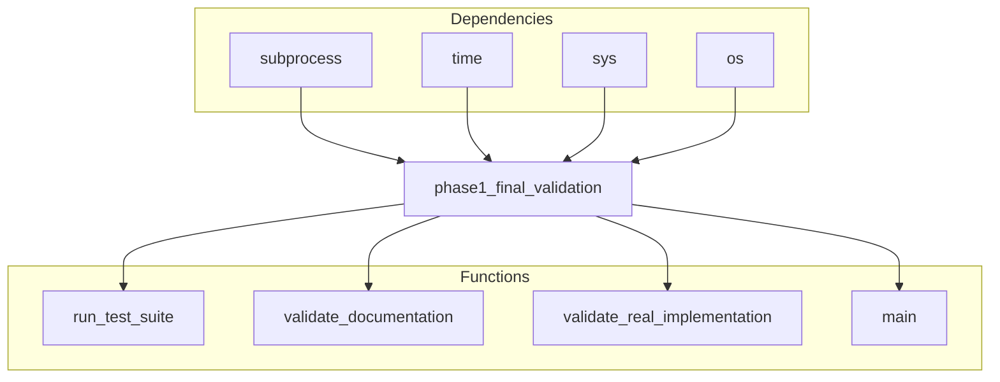

# phase1_final_validation - Architectural Flowchart

```mermaid
graph TD
    M[phase1_final_validation]

    subgraph "Functions"
        F0[run_test_suite]
        F1[validate_documentation]
        F2[validate_real_implementation]
        F3[main]
    end

    M --> F0
    M --> F1
    M --> F2
    M --> F3
    subgraph "Dependencies"
        D0[subprocess]
        D1[time]
        D2[sys]
        D3[os]
    end

    D0 --> M
    D1 --> M
    D2 --> M
    D3 --> M
```
