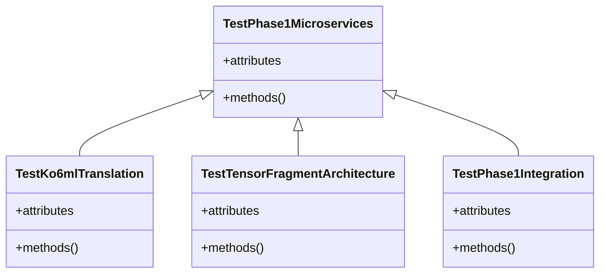

# phase1_tests - Class Diagram

```mermaid
classDiagram

    class TestPhase1Microservices {
        +methods()
        +attributes
    }

    class TestKo6mlTranslation {
        +methods()
        +attributes
    }

    class TestTensorFragmentArchitecture {
        +methods()
        +attributes
    }

    class TestPhase1Integration {
        +methods()
        +attributes
    }

    TestPhase1Microservices <|-- TestKo6mlTranslation
    TestPhase1Microservices <|-- TestTensorFragmentArchitecture
    TestPhase1Microservices <|-- TestPhase1Integration
```
