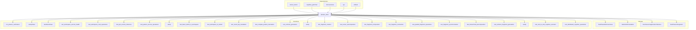

# phase1_tests - Architectural Flowchart

```mermaid
graph TD
    M[phase1_tests]

    subgraph "Classes"
        C0[TestPhase1Microservices]
        C1[TestKo6mlTranslation]
        C2[TestTensorFragmentArchitecture]
        C3[TestPhase1Integration]
    end

    M --> C0
    M --> C1
    M --> C2
    M --> C3
    subgraph "Functions"
        F0[run_phase1_verification]
        F1[setUpClass]
        F2[tearDownClass]
        F3[test_atomspace_service_health]
        F4[test_atomspace_crud_operations]
        F5[test_pln_service_inference]
        F6[test_pattern_service_operations]
        F7[setUp]
        F8[test_basic_ko6ml_to_atomspace]
        F9[test_atomspace_to_ko6ml]
        F10[test_round_trip_translation]
        F11[test_complex_pattern_translation]
        F12[test_scheme_generation]
        F13[setUp]
        F14[test_fragment_creation]
        F15[test_tensor_decomposition]
        F16[test_fragment_composition]
        F17[test_fragment_contraction]
        F18[test_parallel_fragment_operations]
        F19[test_fragment_synchronization]
        F20[test_hierarchical_decomposition]
        F21[test_scheme_fragment_generation]
        F22[setUp]
        F23[test_end_to_end_cognitive_scenario]
        F24[test_distributed_cognitive_operations]
    end

    M --> F0
    M --> F1
    M --> F2
    M --> F3
    M --> F4
    M --> F5
    M --> F6
    M --> F7
    M --> F8
    M --> F9
    M --> F10
    M --> F11
    M --> F12
    M --> F13
    M --> F14
    M --> F15
    M --> F16
    M --> F17
    M --> F18
    M --> F19
    M --> F20
    M --> F21
    M --> F22
    M --> F23
    M --> F24
    subgraph "Dependencies"
        D0[tensor_kernel]
        D1[cognitive_grammar]
        D2[microservices]
        D3[sys]
        D4[unittest]
    end

    D0 --> M
    D1 --> M
    D2 --> M
    D3 --> M
    D4 --> M
```
